# 📁 파일 업로드 시스템 완벽 가이드

이 문서는 Academy API Server의 파일 업로드 시스템에 대한 **완전한 구현 가이드**입니다.  
프론트엔드 개발자가 파일 업로드 기능을 구현할 때 필요한 모든 정보를 단계별로 제공합니다.

## 📋 목차
- [시스템 개요](#-시스템-개요)
- [핵심 개념](#-핵심-개념) 
- [API 엔드포인트](#-api-엔드포인트)
- [시나리오별 구현 가이드](#-시나리오별-구현-가이드)
- [에러 처리](#-에러-처리)
- [베스트 프랙티스](#-베스트-프랙티스)
- [FAQ](#-faq)

---

## 🎯 시스템 개요

### **파일 업로드 2단계 시스템**

```mermaid
graph LR
    A[파일 선택] --> B[임시 업로드]
    B --> C[임시 URL로 미리보기]
    C --> D[공지사항 저장]
    D --> E[정식 파일로 승격]
    E --> F[정식 URL로 자동 변환]
```



1. **임시 업로드**: 사용자가 파일을 선택하면 즉시 임시 저장소에 업로드
2. **미리보기**: 임시 URL로 파일을 미리 확인 가능
3. **정식 저장**: 공지사항 저장 시 임시 파일이 정식 파일로 승격
4. **URL 자동 변환**: content 내 임시 URL이 정식 URL로 자동 변환

### **지원하는 파일 타입**
- **첨부파일**: PDF, DOC, DOCX, XLS, XLSX, TXT, ZIP 등
- **에디터 이미지**: PNG, JPG, JPEG, GIF, WEBP  
- **커버이미지**: PNG, JPG, JPEG (공지사항 대표 이미지)

### **🤔 왜 두 개의 업로드 API가 있나요?**

| API 엔드포인트 | 권장 용도 | 응답 형식 | 실제 저장 방식 |
|---------------|----------|----------|-------------|
| `/api/public/files/upload` | **다른 도메인**에서 범용 파일 업로드 | FileUploadResponse | 임시 저장 |
| `/api/public/files/upload/temp` | **에디터 이미지** 전용 | UploadTempFileResponse | 임시 저장 |

**⭐ 공지사항에서는 모든 파일(첨부파일 포함)이 `/api/public/files/upload/temp`를 사용합니다**
- 첨부파일, 에디터 이미지, 커버 이미지 **모두 동일한 API** 사용
- 모든 파일이 **임시 저장 → 공지사항 저장시 정식화** 과정을 거침
- 응답 형식이 통일되어 프론트엔드 처리가 단순함

---

## 🔑 핵심 개념

### **파일 역할 (FileRole)**
```javascript
const FileRole = {
  ATTACHMENT: 'ATTACHMENT',    // 첨부파일 (다운로드용)
  INLINE: 'INLINE',           // 본문 이미지 (에디터 내 표시)
  COVER: 'COVER'              // 커버 이미지 (대표 이미지)
};
```

### **임시 파일 vs 정식 파일**
```javascript
// 임시 파일 (업로드 직후)
{
  tempFileId: "550e8400-e29b-41d4-a716-446655440000",  // UUID 형태
  previewUrl: "/api/public/files/temp/550e8400-e29b-41d4-a716-446655440000"
}

// 정식 파일 (저장 후)
{
  fileId: 123,  // 숫자 ID
  url: "/api/public/files/download/123"
}
```

### **URL 변환 매커니즘**
```html
<!-- 저장 전: 임시 URL -->


<!-- 저장 후: 자동으로 정식 URL 변환 -->

```

---

## 🔌 API 엔드포인트

### **1. 임시 파일 업로드**
```http
POST /api/public/files/upload/temp
Content-Type: multipart/form-data
Authorization: Bearer {token}

FormData:
- file: [파일 데이터]
- filename: "example.png"
```

**응답:**
```json
{
  "result": "Success",
  "code": "0000", 
  "message": "파일 업로드가 완료되었습니다.",
  "data": {
    "tempFileId": "550e8400-e29b-41d4-a716-446655440000",
    "fileName": "example.png",
    "previewUrl": "/api/public/files/temp/550e8400-e29b-41d4-a716-446655440000",
    "fileSize": 1024000,
    "contentType": "image/png"
  }
}
```

### **2. 임시 파일 미리보기/다운로드**
```http
GET /api/public/files/temp/{tempFileId}
```

### **3. 정식 파일 다운로드**
```http
GET /api/public/files/download/{fileId}
```

### **4. 공지사항 생성 (파일 포함)**
```http
POST /api/admin/notices
Content-Type: application/json
Authorization: Bearer {token}
```

**요청 예시:**
```json
{
  "title": "공지사항 제목",
  "content": "<p>본문 내용 with </p>",
  "categoryId": 1,
  "isImportant": false,
  "isPublished": true,
  "attachmentFiles": [
    {
      "tempFileId": "550e8400-e29b-41d4-a716-446655440000",
      "fileName": "첨부파일.pdf"
    }
  ],
  "inlineImages": [
    {
      "tempFileId": "another-uuid-here",
      "fileName": "에디터이미지.png"
    }
  ]
}
```

**응답 예시:**
```json
{
  "result": "Success",
  "code": "0000",
  "message": "공지사항이 생성되었습니다.",
  "data": 123
}
```

### **5. 공지사항 수정 (파일 포함)**
```http
PUT /api/admin/notices/{id}
Content-Type: application/json
Authorization: Bearer {token}
```

**요청 예시 (새 파일 추가 + 기존 파일 삭제):**
```json
{
  "title": "수정된 제목",
  "content": "<p>수정된 내용</p>",
  "newAttachments": [
    {
      "tempFileId": "new-file-uuid",
      "fileName": "새첨부파일.docx"
    }
  ],
  "newInlineImages": [
    {
      "tempFileId": "new-image-uuid",
      "fileName": "새이미지.png"
    }
  ],
  "deleteAttachmentFileIds": [123, 456],
  "deleteInlineImageFileIds": [789, 101]
}
```

### **6. 공지사항 조회 (파일 정보 포함)**
```http
GET /api/admin/notices/{id}
Authorization: Bearer {token}
```

**응답 예시:**
```json
{
  "result": "Success",
  "data": {
    "id": 123,
    "title": "공지사항 제목",
    "content": "<p>자동 변환된 본문 </p>",
    "attachments": [
      {
        "fileId": "123",
        "fileName": "uuid-filename.pdf",
        "originalName": "첨부파일.pdf",
        "ext": "pdf",
        "size": 1048576,
        "url": "general/2025/12/uuid-filename.pdf"
      }
    ],
    "inlineImages": [
      {
        "fileId": "456",
        "fileName": "uuid-imagename.png",
        "originalName": "에디터이미지.png",
        "ext": "png",
        "size": 524288,
        "url": "general/2025/12/uuid-imagename.png"
      }
    ],
    "createdAt": "2025-12-08 16:10:30",
    "updatedAt": "2025-12-08 16:10:30"
  }
}
```

---

## 🎬 시나리오별 구현 가이드

## 📎 **시나리오 1: 첨부파일 업로드**

### **Step 1: 파일 선택 시 즉시 임시 업로드**

```javascript
// HTML
<input type="file" multiple accept=".pdf,.doc,.docx,.xls,.xlsx,.txt,.zip" 
       onChange={handleAttachmentUpload} />

// JavaScript
const handleAttachmentUpload = async (event) => {
  const files = event.target.files;
  const uploadedAttachments = [];
  
  for (const file of files) {
    try {
      // 1. 임시 업로드 API 호출
      const formData = new FormData();
      formData.append('file', file);
      formData.append('filename', file.name);
      
      const response = await fetch('/api/public/files/upload/temp', {
        method: 'POST',
        headers: {
          'Authorization': `Bearer ${token}`
        },
        body: formData
      });
      
      const result = await response.json();
      
      if (result.result === 'Success') {
        // 2. 업로드된 파일 정보 저장
        uploadedAttachments.push({
          tempFileId: result.data.tempFileId,
          fileName: result.data.fileName,
          fileSize: result.data.fileSize,
          previewUrl: result.data.previewUrl
        });
        
        console.log('첨부파일 업로드 성공:', result.data.fileName);
      }
    } catch (error) {
      console.error('첨부파일 업로드 실패:', error);
      // 사용자에게 에러 알림 표시
    }
  }
  
  // 3. 상태 업데이트
  setAttachments(prev => [...prev, ...uploadedAttachments]);
};
```

### **Step 2: 첨부파일 목록 표시**

```javascript
// 업로드된 첨부파일 목록 렌더링
const AttachmentList = ({ attachments, onRemove }) => {
  return (
    <div className="attachment-list">
      {attachments.map((attachment, index) => (
        <div key={attachment.tempFileId} className="attachment-item">
          <span className="file-icon">📎</span>
          <span className="file-name">{attachment.fileName}</span>
          <span className="file-size">{formatFileSize(attachment.fileSize)}</span>
          <button onClick={() => onRemove(index)}>삭제</button>
        </div>
      ))}
    </div>
  );
};

const formatFileSize = (bytes) => {
  if (bytes === 0) return '0 Bytes';
  const k = 1024;
  const sizes = ['Bytes', 'KB', 'MB', 'GB'];
  const i = Math.floor(Math.log(bytes) / Math.log(k));
  return parseFloat((bytes / Math.pow(k, i)).toFixed(2)) + ' ' + sizes[i];
};
```

### **Step 3: 공지사항 저장 시 첨부파일 정보 전달**

```javascript
const handleSaveNotice = async () => {
  const noticeData = {
    title: title,
    content: content,
    categoryId: selectedCategoryId,
    isImportant: isImportant,
    isPublished: isPublished,
    
    // 첨부파일 정보 - 새로운 형식 (tempFileId와 fileName)
    attachmentFiles: attachments.map(attachment => ({
      tempFileId: attachment.tempFileId,  // 임시 파일 ID
      fileName: attachment.fileName       // 원본 파일명
    })),
    
    // 본문 이미지 정보 - 에디터에서 추출
    inlineImages: extractInlineImages(content)
  };
  
  try {
    const response = await fetch('/api/admin/notices', {
      method: 'POST',
      headers: {
        'Content-Type': 'application/json',
        'Authorization': `Bearer ${token}`
      },
      body: JSON.stringify(noticeData)
    });
    
    const result = await response.json();
    
    if (result.result === 'Success') {
      console.log('공지사항 생성 성공, ID:', result.data);
      // 성공 처리 - 상세 페이지로 이동 등
      
      // 백엔드에서 자동 처리됨:
      // 1. 임시파일 → 정식파일 승격
      // 2. UploadFileLink 생성 (role: ATTACHMENT)
      // 3. 데이터베이스에 파일 정보 저장
    }
  } catch (error) {
    console.error('공지사항 저장 실패:', error);
  }
};

// 본문 내용에서 임시 이미지 정보 추출하는 도우미 함수
const extractInlineImages = (content) => {
  const tempImagePattern = /\/api\/public\/files\/temp\/([a-f0-9-]+)/g;
  const matches = [...content.matchAll(tempImagePattern)];
  
  return matches.map(match => ({
    tempFileId: match[1],
    fileName: `image-${match[1].slice(0, 8)}.png` // 기본 이름, 실제로는 업로드시 저장된 이름 사용
  }));
};
```

---

## 🖼️ **시나리오 2: 에디터 이미지 업로드**

### **Step 1: 에디터 설정 (TipTap 예시)**

```javascript
import { Editor } from '@tiptap/react';
import Image from '@tiptap/extension-image';

const NoticeEditor = ({ content, onChange }) => {
  const editor = useEditor({
    extensions: [
      Image.configure({
        inline: true,
        allowBase64: true,
      }),
    ],
    content: content,
    onUpdate: ({ editor }) => {
      onChange(editor.getHTML());
    },
  });

  // 이미지 업로드 핸들러
  const handleImageUpload = async (file) => {
    try {
      // 1. 임시 업로드
      const formData = new FormData();
      formData.append('file', file);
      formData.append('filename', file.name);
      
      const response = await fetch('/api/public/files/upload/temp', {
        method: 'POST',
        headers: {
          'Authorization': `Bearer ${token}`
        },
        body: formData
      });
      
      const result = await response.json();
      
      if (result.result === 'Success') {
        // 2. 에디터에 임시 URL로 이미지 삽입
        const tempUrl = result.data.previewUrl;
        editor.chain().focus().setImage({ src: tempUrl }).run();
        
        // 3. 업로드된 이미지 정보 추적
        addInlineImage({
          tempFileId: result.data.tempFileId,
          fileName: result.data.fileName,
          tempUrl: tempUrl
        });
        
        console.log('이미지 업로드 성공:', result.data.fileName);
      }
    } catch (error) {
      console.error('이미지 업로드 실패:', error);
    }
  };

  // 드래그앤드롭 처리
  const handleDrop = (event) => {
    event.preventDefault();
    const files = event.dataTransfer.files;
    
    for (const file of files) {
      if (file.type.startsWith('image/')) {
        handleImageUpload(file);
      }
    }
  };

  // 붙여넣기 처리
  const handlePaste = (event) => {
    const items = event.clipboardData?.items;
    
    for (const item of items || []) {
      if (item.type.startsWith('image/')) {
        const file = item.getAsFile();
        if (file) {
          event.preventDefault();
          handleImageUpload(file);
        }
      }
    }
  };

  return (
    <div 
      onDrop={handleDrop}
      onDragOver={(e) => e.preventDefault()}
      onPaste={handlePaste}
    >
      <EditorContent editor={editor} />
      <input 
        type="file" 
        accept="image/*"
        onChange={(e) => {
          const file = e.target.files?.[0];
          if (file) handleImageUpload(file);
        }}
      />
    </div>
  );
};
```

### **Step 2: 업로드된 이미지 추적**

```javascript
const [inlineImages, setInlineImages] = useState([]);

const addInlineImage = (imageInfo) => {
  setInlineImages(prev => [...prev, imageInfo]);
};

// content에서 실제 사용된 이미지만 필터링하는 함수
const getUsedInlineImages = (content) => {
  return inlineImages.filter(image => {
    return content.includes(image.tempUrl);
  });
};
```

### **Step 3: 공지사항 저장 시 본문 이미지 처리**

```javascript
const handleSaveNotice = async () => {
  // content에서 실제 사용된 이미지만 추출
  const usedImages = getUsedInlineImages(content);
  
  const noticeData = {
    title: title,
    content: content,  // 임시 URL이 포함된 content
    categoryId: selectedCategoryId,
    
    // 본문에 사용된 이미지 정보
    inlineImages: usedImages.map(image => ({
      tempFileId: image.tempFileId,  // 임시 파일 ID
      fileName: image.fileName       // 원본 파일명
    }))
  };
  
  try {
    const response = await fetch('/api/admin/notices', {
      method: 'POST',
      headers: {
        'Content-Type': 'application/json',
        'Authorization': `Bearer ${token}`
      },
      body: JSON.stringify(noticeData)
    });
    
    const result = await response.json();
    
    if (result.result === 'Success') {
      console.log('공지사항 생성 성공');
      
      // 백엔드에서 자동 처리됨:
      // 1. 임시파일 → 정식파일 승격
      // 2. content 내 임시 URL → 정식 URL 자동 변환
      // 3. UploadFileLink 생성 (role: INLINE)
    }
  } catch (error) {
    console.error('공지사항 저장 실패:', error);
  }
};
```

---

## 🎨 **시나리오 3: 커버 이미지 업로드**

### **Step 1: 커버 이미지 선택 및 업로드**

```javascript
const CoverImageUpload = ({ coverImage, onCoverImageChange }) => {
  const handleCoverImageUpload = async (file) => {
    try {
      const formData = new FormData();
      formData.append('file', file);
      formData.append('filename', file.name);
      
      const response = await fetch('/api/public/files/upload/temp', {
        method: 'POST',
        headers: {
          'Authorization': `Bearer ${token}`
        },
        body: formData
      });
      
      const result = await response.json();
      
      if (result.result === 'Success') {
        onCoverImageChange({
          tempFileId: result.data.tempFileId,
          fileName: result.data.fileName,
          previewUrl: result.data.previewUrl
        });
        
        console.log('커버 이미지 업로드 성공');
      }
    } catch (error) {
      console.error('커버 이미지 업로드 실패:', error);
    }
  };

  return (
    <div className="cover-image-upload">
      <div className="image-preview">
        {coverImage ? (
          <div className="preview-container">
            
            <button 
              className="remove-btn"
              onClick={() => onCoverImageChange(null)}
            >
              삭제
            </button>
          </div>
        ) : (
          <div className="upload-placeholder">
            <span>커버 이미지를 선택하세요</span>
          </div>
        )}
      </div>
      
      <input
        type="file"
        accept="image/*"
        onChange={(e) => {
          const file = e.target.files?.[0];
          if (file) handleCoverImageUpload(file);
        }}
        className="file-input"
      />
    </div>
  );
};
```

### **Step 2: 공지사항 저장 시 커버 이미지 포함**

```javascript
const handleSaveNotice = async () => {
  const noticeData = {
    title: title,
    content: content,
    categoryId: selectedCategoryId,
    
    // 커버 이미지 (단일 파일)
    coverImages: coverImage ? [{
      tempFileId: coverImage.tempFileId,
      fileName: coverImage.fileName
    }] : []
  };
  
  // 저장 로직은 동일...
};
```

---

## ✏️ **시나리오 4: 공지사항 수정**

### **Step 1: 기존 공지사항 데이터 로딩**

```javascript
const loadExistingNotice = async (noticeId) => {
  try {
    const response = await fetch(`/api/admin/notices/${noticeId}`, {
      headers: {
        'Authorization': `Bearer ${token}`
      }
    });
    
    const result = await response.json();
    
    if (result.result === 'Success') {
      const notice = result.data;
      
      // 기본 정보 설정
      setTitle(notice.title);
      setContent(notice.content);
      setCategoryId(notice.categoryId);
      
      // 기존 첨부파일 (정식 파일들)
      const existingAttachments = notice.attachments?.map(file => ({
        fileId: file.fileId,        // 정식 파일 ID (숫자)
        fileName: file.fileName,
        url: file.url,              // /api/public/files/download/{id}
        isExisting: true            // 기존 파일 표시
      })) || [];
      setAttachments(existingAttachments);
      
      // 기존 본문 이미지는 content에 정식 URL로 포함되어 있음
      // 
      
      // 기존 커버 이미지
      const existingCoverImage = notice.coverImages?.[0];
      if (existingCoverImage) {
        setCoverImage({
          fileId: existingCoverImage.fileId,
          fileName: existingCoverImage.fileName,
          previewUrl: existingCoverImage.url,
          isExisting: true
        });
      }
    }
  } catch (error) {
    console.error('공지사항 로딩 실패:', error);
  }
};
```

### **Step 2: 새 파일 추가 처리**

```javascript
// 새 첨부파일 추가 (기존 파일과 구분)
const handleNewAttachmentUpload = async (files) => {
  const newAttachments = [];
  
  for (const file of files) {
    // 임시 업로드 (시나리오 1과 동일)
    const uploadResult = await uploadTempFile(file);
    
    if (uploadResult) {
      newAttachments.push({
        tempFileId: uploadResult.tempFileId,
        fileName: uploadResult.fileName,
        previewUrl: uploadResult.previewUrl,
        isNew: true  // 새 파일 표시
      });
    }
  }
  
  setAttachments(prev => [...prev, ...newAttachments]);
};

// 새 본문 이미지 추가 (시나리오 2와 동일)
const handleNewImageUpload = async (file) => {
  // 에디터에 임시 URL로 이미지 추가
  // inlineImages 배열에 새 이미지 정보 추가
};
```

### **Step 3: 파일 삭제 처리**

```javascript
const [filesToDelete, setFilesToDelete] = useState({
  attachments: [],    // 삭제할 기존 첨부파일 ID들
  inlineImages: []    // 삭제할 기존 본문 이미지 ID들
});

const handleRemoveExistingAttachment = (fileId) => {
  // UI에서 제거
  setAttachments(prev => prev.filter(file => file.fileId !== fileId));
  
  // 삭제 목록에 추가
  setFilesToDelete(prev => ({
    ...prev,
    attachments: [...prev.attachments, fileId]
  }));
};

const handleRemoveExistingInlineImage = (fileId) => {
  // content에서 해당 이미지 태그 제거
  const updatedContent = content.replace(
    new RegExp(`]*src="/api/public/files/download/${fileId}"[^>]*>`, 'g'),
    ''
  );
  setContent(updatedContent);
  
  // 삭제 목록에 추가
  setFilesToDelete(prev => ({
    ...prev,
    inlineImages: [...prev.inlineImages, fileId]
  }));
};
```

### **Step 4: 수정된 공지사항 저장**

```javascript
const handleUpdateNotice = async () => {
  // 새로 업로드된 파일들만 추출
  const newAttachments = attachments
    .filter(file => file.isNew)
    .map(file => ({
      tempFileId: file.tempFileId,
      fileName: file.fileName
    }));

  const newInlineImages = getNewInlineImages(content);

  const updateData = {
    title: title,
    content: content,  // 기존 정식 URL + 새 임시 URL 혼합
    categoryId: categoryId,
    
    // 새로 추가할 파일들
    newAttachments: newAttachments,
    newInlineImages: newInlineImages,
    
    // 삭제할 기존 파일들
    deleteAttachmentFileIds: filesToDelete.attachments,
    deleteInlineImageFileIds: filesToDelete.inlineImages,
    
    // 커버 이미지 처리 (추가/삭제)
    ...(coverImage?.isNew ? {
      newCoverImages: [{
        tempFileId: coverImage.tempFileId,
        fileName: coverImage.fileName
      }]
    } : {}),
    
    // 기존 커버 이미지 삭제 (사용자가 삭제 버튼 클릭한 경우)
    ...(shouldDeleteCoverImage ? {
      deleteCoverImageFileId: existingCoverImage.fileId
    } : {})
  };
  
  try {
    const response = await fetch(`/api/admin/notices/${noticeId}`, {
      method: 'PUT',
      headers: {
        'Content-Type': 'application/json',
        'Authorization': `Bearer ${token}`
      },
      body: JSON.stringify(updateData)
    });
    
    const result = await response.json();
    
    if (result.result === 'Success') {
      console.log('공지사항 수정 성공');
      
      // 백엔드에서 처리 순서:
      // 1. 선택된 기존 파일들 삭제
      // 2. 새 임시파일들을 정식파일로 승격
      // 3. newInlineImages의 content URL 변환
      // 4. 기존 파일 + 새 파일 조합으로 최종 저장
    }
  } catch (error) {
    console.error('공지사항 수정 실패:', error);
  }
};
```

---

## 🔥 **시나리오 5: 복합 상황 (모든 파일 타입)**

### **종합 예시: 모든 파일 타입을 포함한 공지사항 저장**

```javascript
const handleSaveComplexNotice = async () => {
  // 모든 파일 타입 수집
  const attachmentFiles = attachments
    .filter(file => file.isNew)
    .map(file => ({ tempFileId: file.tempFileId, fileName: file.fileName }));

  const inlineImageFiles = getUsedInlineImages(content)
    .map(image => ({ tempFileId: image.tempFileId, fileName: image.fileName }));

  const coverImageFiles = coverImage ? [{
    tempFileId: coverImage.tempFileId,
    fileName: coverImage.fileName
  }] : [];

  const noticeData = {
    title: "복합 파일 테스트",
    content: "<!-- 임시 URL들이 포함된 에디터 content -->",
    categoryId: 1,
    
    // 모든 파일 타입 포함
    attachments: attachmentFiles,     // 첨부파일들
    inlineImages: inlineImageFiles,   // 본문 이미지들  
    coverImages: coverImageFiles      // 커버 이미지
  };
  
  console.log('저장할 파일 정보:', {
    attachments: attachmentFiles.length,
    inlineImages: inlineImageFiles.length,
    coverImages: coverImageFiles.length
  });
  
  // 저장 API 호출
  const response = await saveNotice(noticeData);
  
  // 성공 시 모든 임시 파일이 정식 파일로 승격되고
  // content의 URL들이 자동으로 변환됨
};
```

---

## ⚠️ 에러 처리

### **공통 에러 상황과 대응 방법**

```javascript
const handleFileUpload = async (file) => {
  try {
    // 1. 파일 크기 검증
    if (file.size > 10 * 1024 * 1024) { // 10MB
      throw new Error('파일 크기는 10MB를 초과할 수 없습니다.');
    }
    
    // 2. 파일 타입 검증
    const allowedTypes = ['image/jpeg', 'image/png', 'image/gif', 'application/pdf'];
    if (!allowedTypes.includes(file.type)) {
      throw new Error('지원하지 않는 파일 형식입니다.');
    }
    
    // 3. 업로드 API 호출
    const response = await fetch('/api/public/files/upload/temp', {
      method: 'POST',
      headers: { 'Authorization': `Bearer ${token}` },
      body: formData
    });
    
    // 4. HTTP 에러 확인
    if (!response.ok) {
      if (response.status === 413) {
        throw new Error('파일 크기가 너무 큽니다.');
      } else if (response.status === 401) {
        throw new Error('로그인이 필요합니다.');
      } else if (response.status === 415) {
        throw new Error('지원하지 않는 파일 형식입니다.');
      } else {
        throw new Error('파일 업로드에 실패했습니다.');
      }
    }
    
    const result = await response.json();
    
    // 5. 비즈니스 로직 에러 확인
    if (result.result !== 'Success') {
      throw new Error(result.message || '파일 업로드에 실패했습니다.');
    }
    
    return result.data;
    
  } catch (error) {
    console.error('파일 업로드 에러:', error);
    
    // 6. 사용자 친화적 에러 메시지 표시
    showErrorMessage(error.message);
    
    return null;
  }
};

// 에러 메시지 표시 함수
const showErrorMessage = (message) => {
  // Toast, Alert, 또는 다른 UI 컴포넌트로 에러 표시
  toast.error(message);
};
```

### **네트워크 에러 재시도 로직**

```javascript
const uploadWithRetry = async (file, maxRetries = 3) => {
  for (let i = 0; i < maxRetries; i++) {
    try {
      return await uploadTempFile(file);
    } catch (error) {
      console.warn(`업로드 실패 (${i + 1}/${maxRetries}):`, error.message);
      
      if (i === maxRetries - 1) {
        throw error; // 마지막 시도에서 실패하면 에러를 던짐
      }
      
      // 재시도 전 잠시 대기 (지수 백오프)
      await new Promise(resolve => setTimeout(resolve, Math.pow(2, i) * 1000));
    }
  }
};
```

---

## 🏆 베스트 프랙티스

### **1. 파일 크기와 개수 제한**

```javascript
const FILE_CONFIG = {
  maxFileSize: 10 * 1024 * 1024, // 10MB
  maxAttachments: 5,              // 첨부파일 최대 5개
  maxInlineImages: 10,            // 본문 이미지 최대 10개
  
  allowedImageTypes: ['image/jpeg', 'image/png', 'image/gif', 'image/webp'],
  allowedDocumentTypes: [
    'application/pdf', 
    'application/msword', 
    'application/vnd.openxmlformats-officedocument.wordprocessingml.document',
    'application/vnd.ms-excel',
    'application/vnd.openxmlformats-officedocument.spreadsheetml.sheet',
    'text/plain',
    'application/zip'
  ]
};

const validateFile = (file, fileType) => {
  // 크기 검증
  if (file.size > FILE_CONFIG.maxFileSize) {
    throw new Error(`파일 크기는 ${formatFileSize(FILE_CONFIG.maxFileSize)}를 초과할 수 없습니다.`);
  }
  
  // 타입 검증
  const allowedTypes = fileType === 'image' 
    ? FILE_CONFIG.allowedImageTypes 
    : FILE_CONFIG.allowedDocumentTypes;
    
  if (!allowedTypes.includes(file.type)) {
    throw new Error('지원하지 않는 파일 형식입니다.');
  }
  
  return true;
};
```

### **2. 업로드 진행상황 표시**

```javascript
const uploadWithProgress = async (file, onProgress) => {
  const formData = new FormData();
  formData.append('file', file);
  formData.append('filename', file.name);
  
  const xhr = new XMLHttpRequest();
  
  return new Promise((resolve, reject) => {
    xhr.upload.addEventListener('progress', (event) => {
      if (event.lengthComputable) {
        const percentComplete = (event.loaded / event.total) * 100;
        onProgress(Math.round(percentComplete));
      }
    });
    
    xhr.addEventListener('load', () => {
      if (xhr.status === 200) {
        const result = JSON.parse(xhr.responseText);
        resolve(result);
      } else {
        reject(new Error('업로드 실패'));
      }
    });
    
    xhr.addEventListener('error', () => {
      reject(new Error('네트워크 오류'));
    });
    
    xhr.open('POST', '/api/public/files/upload/temp');
    xhr.setRequestHeader('Authorization', `Bearer ${token}`);
    xhr.send(formData);
  });
};

// 사용 예시
const handleUploadWithProgress = async (file) => {
  setUploadProgress(0);
  setIsUploading(true);
  
  try {
    const result = await uploadWithProgress(file, (progress) => {
      setUploadProgress(progress);
    });
    
    console.log('업로드 완료:', result);
  } catch (error) {
    console.error('업로드 실패:', error);
  } finally {
    setIsUploading(false);
    setUploadProgress(0);
  }
};
```

### **3. 메모리 효율적인 미리보기**

```javascript
const createPreviewUrl = (file) => {
  // 이미지 파일인 경우에만 로컬 미리보기 생성
  if (file.type.startsWith('image/')) {
    return URL.createObjectURL(file);
  }
  return null;
};

const PreviewImage = ({ file, tempUrl, onLoad }) => {
  const [previewUrl, setPreviewUrl] = useState(null);
  
  useEffect(() => {
    if (file) {
      const url = createPreviewUrl(file);
      setPreviewUrl(url);
      
      // 컴포넌트 언마운트 시 메모리 해제
      return () => {
        if (url) URL.revokeObjectURL(url);
      };
    }
  }, [file]);
  
  return (
     {
        console.error('이미지 로드 실패:', e);
        e.target.src = '/placeholder-image.png'; // 대체 이미지
      }}
    />
  );
};
```

### **4. 자동 저장 및 복구**

```javascript
// 자동 저장 훅
const useAutoSave = (data, interval = 30000) => { // 30초마다
  useEffect(() => {
    const autoSaveTimer = setInterval(() => {
      // 로컬 스토리지에 임시 저장
      localStorage.setItem('notice-draft', JSON.stringify({
        ...data,
        lastSaved: Date.now()
      }));
      console.log('자동 저장 완료');
    }, interval);
    
    return () => clearInterval(autoSaveTimer);
  }, [data, interval]);
};

// 복구 함수
const recoverDraft = () => {
  try {
    const draft = localStorage.getItem('notice-draft');
    if (draft) {
      const data = JSON.parse(draft);
      const now = Date.now();
      const oneHour = 60 * 60 * 1000;
      
      // 1시간 이내의 데이터만 복구
      if (now - data.lastSaved < oneHour) {
        return data;
      }
    }
  } catch (error) {
    console.error('임시저장 데이터 복구 실패:', error);
  }
  return null;
};
```

### **5. 파일 업로드 상태 관리**

```javascript
// 파일 업로드 상태를 관리하는 커스텀 훅
const useFileUpload = () => {
  const [uploadStates, setUploadStates] = useState({});
  
  const startUpload = (fileId) => {
    setUploadStates(prev => ({
      ...prev,
      [fileId]: { status: 'uploading', progress: 0, error: null }
    }));
  };
  
  const updateProgress = (fileId, progress) => {
    setUploadStates(prev => ({
      ...prev,
      [fileId]: { ...prev[fileId], progress }
    }));
  };
  
  const completeUpload = (fileId, result) => {
    setUploadStates(prev => ({
      ...prev,
      [fileId]: { status: 'completed', progress: 100, result, error: null }
    }));
  };
  
  const failUpload = (fileId, error) => {
    setUploadStates(prev => ({
      ...prev,
      [fileId]: { status: 'failed', progress: 0, error }
    }));
  };
  
  return {
    uploadStates,
    startUpload,
    updateProgress, 
    completeUpload,
    failUpload
  };
};
```

---

## ❓ FAQ

### **Q1: 임시 파일이 언제 삭제되나요?**
A1: 임시 파일은 업로드 후 1시간이 지나면 자동으로 삭제됩니다(정책상 계획, 배치 작업에서 주기적으로 삭제 처리). 공지사항을 저장하면 임시 파일이 정식 파일로 승격되어 영구 보존됩니다.

### **Q2: content와 inlineImages의 tempFileId가 다르면 어떻게 되나요?**
A2: content에 포함된 임시 URL과 inlineImages의 tempFileId가 일치하지 않으면 해당 파일은 변환되지 않습니다. 백엔드에서 경고 로그가 남고 무시됩니다.

### **Q3: 수정 시 기존 파일과 새 파일을 어떻게 구분하나요?**
A3: 
- 기존 파일: `fileId`가 숫자, URL이 `/api/public/files/download/123` 형태
- 새 파일: `tempFileId`가 UUID, URL이 `/api/public/files/temp/uuid` 형태  
- `newAttachmentFiles`, `newInlineImages` 필드를 사용하여 새 파일만 전달 (모두 tempFileId 사용)

### **Q4: 동일한 파일을 여러 번 업로드하면 어떻게 되나요?**
A4: 각각 별개의 임시 파일로 처리됩니다. 백엔드에서 파일 중복 검사를 하지 않으므로 프론트에서 중복 업로드를 방지해야 합니다.

### **Q5: 업로드 중에 페이지를 벗어나면 어떻게 되나요?**
A5: 업로드 중인 파일은 중단될 수 있습니다. `beforeunload` 이벤트로 경고 메시지를 표시하거나, 임시저장 기능을 활용하여 데이터 손실을 방지하세요.

### **Q6: 이미지 크기를 자동으로 조정할 수 있나요?**
A6: 현재 백엔드에서는 이미지 리사이징을 지원하지 않습니다. 프론트에서 Canvas API를 사용하여 업로드 전에 이미지를 압축할 수 있습니다.

```javascript
// 이미지 압축 예시
const compressImage = (file, maxWidth = 1920, quality = 0.8) => {
  return new Promise((resolve) => {
    const canvas = document.createElement('canvas');
    const ctx = canvas.getContext('2d');
    const img = new Image();
    
    img.onload = () => {
      const ratio = Math.min(maxWidth / img.width, maxWidth / img.height);
      canvas.width = img.width * ratio;
      canvas.height = img.height * ratio;
      
      ctx.drawImage(img, 0, 0, canvas.width, canvas.height);
      
      canvas.toBlob(resolve, 'image/jpeg', quality);
    };
    
    img.src = URL.createObjectURL(file);
  });
};
```

---

## 💻 React 컴포넌트 완전한 예시

```jsx
import React, { useState } from 'react';

const NoticeEditor = () => {
  const [title, setTitle] = useState('');
  const [content, setContent] = useState('');
  const [attachments, setAttachments] = useState([]);
  const [uploadedImages, setUploadedImages] = useState([]);
  const [isLoading, setIsLoading] = useState(false);

  // 파일 업로드 (공통)
  const uploadFile = async (file) => {
    const formData = new FormData();
    formData.append('file', file);

    const response = await fetch('/api/public/files/upload/temp', {
      method: 'POST',
      headers: {
        'Authorization': `Bearer ${localStorage.getItem('accessToken')}`
      },
      body: formData
    });

    if (!response.ok) throw new Error('Upload failed');
    
    const result = await response.json();
    return result.data;
  };

  // 첨부파일 핸들러
  const handleAttachmentChange = async (e) => {
    const files = Array.from(e.target.files);
    
    for (const file of files) {
      try {
        const uploadResult = await uploadFile(file);
        setAttachments(prev => [...prev, {
          tempFileId: uploadResult.tempFileId,
          fileName: file.name,
          size: uploadResult.size
        }]);
      } catch (error) {
        alert(`파일 업로드 실패: ${file.name}`);
      }
    }
  };

  // 에디터 이미지 핸들러 (TipTap 예시)
  const handleEditorImageUpload = async (file) => {
    try {
      const uploadResult = await uploadFile(file);
      
      // 에디터에 이미지 삽입
      editor?.chain().focus().setImage({
        src: uploadResult.previewUrl,
        'data-temp-id': uploadResult.tempFileId
      }).run();
      
      setUploadedImages(prev => [...prev, {
        tempFileId: uploadResult.tempFileId,
        fileName: uploadResult.fileName
      }]);
      
    } catch (error) {
      alert('이미지 업로드 실패');
    }
  };

  // 공지사항 저장
  const handleSubmit = async (e) => {
    e.preventDefault();
    setIsLoading(true);

    try {
      // 에디터 내 이미지 정보 추출
      const parser = new DOMParser();
      const doc = parser.parseFromString(content, 'text/html');
      const editorImages = Array.from(doc.querySelectorAll('img[data-temp-id]'));
      
      const inlineImages = editorImages.map(img => ({
        tempFileId: img.getAttribute('data-temp-id'),
        fileName: uploadedImages.find(ui => ui.tempFileId === img.getAttribute('data-temp-id'))?.fileName || 'image.png'
      }));

      const requestData = {
        title,
        content, // 임시 URL 포함된 상태로 전송
        categoryId: 1,
        isImportant: false,
        isPublished: true,
        attachmentFiles: attachments.map(att => ({
          tempFileId: att.tempFileId,
          fileName: att.fileName
        })),
        inlineImages
      };

      const response = await fetch('/api/admin/notices', {
        method: 'POST',
        headers: {
          'Content-Type': 'application/json',
          'Authorization': `Bearer ${localStorage.getItem('accessToken')}`
        },
        body: JSON.stringify(requestData)
      });

      if (!response.ok) throw new Error('저장 실패');

      const result = await response.json();
      alert('공지사항이 저장되었습니다.');
      
      // 페이지 이동 또는 초기화
      window.location.href = `/notices/${result.data}`;
      
    } catch (error) {
      alert('저장에 실패했습니다: ' + error.message);
    } finally {
      setIsLoading(false);
    }
  };

  return (
    <form onSubmit={handleSubmit}>
      {/* 제목 입력 */}
      <input
        type="text"
        placeholder="제목을 입력하세요"
        value={title}
        onChange={(e) => setTitle(e.target.value)}
        required
      />

      {/* 에디터 (TipTap, Quill 등) */}
      <div className="editor-container">
        {/* 에디터 컴포넌트 */}
      </div>

      {/* 첨부파일 업로드 */}
      <div className="attachment-section">
        <label>첨부파일</label>
        <input
          type="file"
          multiple
          onChange={handleAttachmentChange}
          accept=".pdf,.doc,.docx,.xls,.xlsx,.txt,.zip"
        />
        
        {/* 첨부파일 목록 */}
        <ul>
          {attachments.map(file => (
            <li key={file.tempFileId}>
              {file.fileName} ({(file.size / 1024).toFixed(1)}KB)
              <button 
                type="button"
                onClick={() => setAttachments(prev => 
                  prev.filter(f => f.tempFileId !== file.tempFileId)
                )}
              >
                삭제
              </button>
            </li>
          ))}
        </ul>
      </div>

      {/* 저장 버튼 */}
      <button type="submit" disabled={isLoading}>
        {isLoading ? '저장 중...' : '공지사항 저장'}
      </button>
    </form>
  );
};

export default NoticeEditor;
```

---

## 🚨 고급 에러 처리 방법

```javascript
// 포괄적인 에러 처리가 포함된 업로드 함수
async function uploadFileWithErrorHandling(file) {
  try {
    // 1. 파일 크기 검증
    if (file.size > 10 * 1024 * 1024) { // 10MB
      throw new Error('파일 크기는 10MB를 초과할 수 없습니다.');
    }
    
    // 2. 파일 타입 검증
    const allowedTypes = ['image/jpeg', 'image/png', 'image/gif', 'application/pdf'];
    if (!allowedTypes.includes(file.type)) {
      throw new Error('지원하지 않는 파일 형식입니다.');
    }
    
    const formData = new FormData();
    formData.append('file', file);

    const response = await fetch('/api/public/files/upload/temp', {
      method: 'POST',
      headers: {
        'Authorization': `Bearer ${getAccessToken()}`
      },
      body: formData
    });

    // 3. HTTP 에러 확인
    if (!response.ok) {
      if (response.status === 413) {
        throw new Error('파일 크기가 너무 큽니다.');
      } else if (response.status === 401) {
        throw new Error('로그인이 필요합니다.');
      } else if (response.status === 415) {
        throw new Error('지원하지 않는 파일 형식입니다.');
      } else {
        throw new Error('파일 업로드에 실패했습니다.');
      }
    }
    
    const result = await response.json();
    
    // 4. 비즈니스 로직 에러 확인
    if (result.result !== 'Success') {
      throw new Error(result.message || '파일 업로드에 실패했습니다.');
    }
    
    return result.data;
    
  } catch (error) {
    console.error('파일 업로드 에러:', error);
    
    // 5. 사용자 친화적 에러 메시지 표시
    showErrorMessage(error.message);
    
    return null;
  }
}

// 에러 메시지 표시 함수
const showErrorMessage = (message) => {
  // Toast, Alert, 또는 다른 UI 컴포넌트로 에러 표시
  // toast.error(message);
  alert(message); // 간단한 예시
};

// 재시도 로직이 포함된 업로드
const uploadWithRetry = async (file, maxRetries = 3) => {
  for (let i = 0; i < maxRetries; i++) {
    try {
      return await uploadFileWithErrorHandling(file);
    } catch (error) {
      console.warn(`업로드 실패 (${i + 1}/${maxRetries}):`, error.message);
      
      if (i === maxRetries - 1) {
        throw error; // 마지막 시도에서 실패하면 에러를 던짐
      }
      
      // 재시도 전 잠시 대기 (지수 백오프)
      await new Promise(resolve => setTimeout(resolve, Math.pow(2, i) * 1000));
    }
  }
};
```

---

## 📊 필드명 매핑 참조표

| 상황 | 첨부파일 필드명 | 본문이미지 필드명 | 설명 |
|------|----------------|------------------|------|
| **요청 시 (Create)** | `attachmentFiles` | `inlineImages` | 새 공지사항 생성 |
| **요청 시 (Update)** | `newAttachments` | `newInlineImages` | 기존 공지사항에 새 파일 추가 |
| **응답 시 (Response)** | `attachments` | `inlineImages` | 조회 결과 (정식 파일 정보) |
| **삭제 시 (Update)** | `deleteAttachmentFileIds` | `deleteInlineImageFileIds` | 기존 파일 삭제 |

**💡 핵심**: 요청과 응답에서 필드명이 다를 수 있으니 주의!

---

## 🎯 결론

이 가이드를 따라 구현하면:

1. ✅ **안정적인 파일 업로드**: 2단계 업로드로 사용자 경험 향상
2. ✅ **자동 URL 변환**: 임시 URL → 정식 URL 자동 처리
3. ✅ **유연한 파일 관리**: 첨부파일, 이미지, 커버이미지 모두 지원  
4. ✅ **효율적인 수정**: 기존 파일 유지하며 선택적 추가/삭제
5. ✅ **강력한 에러 처리**: 다양한 에러 상황 대응

**모든 파일 업로드 시나리오가 완벽하게 작동하는 시스템을 구축할 수 있습니다!** 🚀

---

## 📞 지원

문제가 발생하거나 추가 기능이 필요한 경우:
1. 백엔드 로그 확인: 파일 변환 과정의 상세 로그 제공
2. 브라우저 개발자 도구: Network 탭에서 API 요청/응답 확인  
3. 이 문서의 예시 코드 참고: 모든 시나리오에 대한 완전한 구현 예시 제공