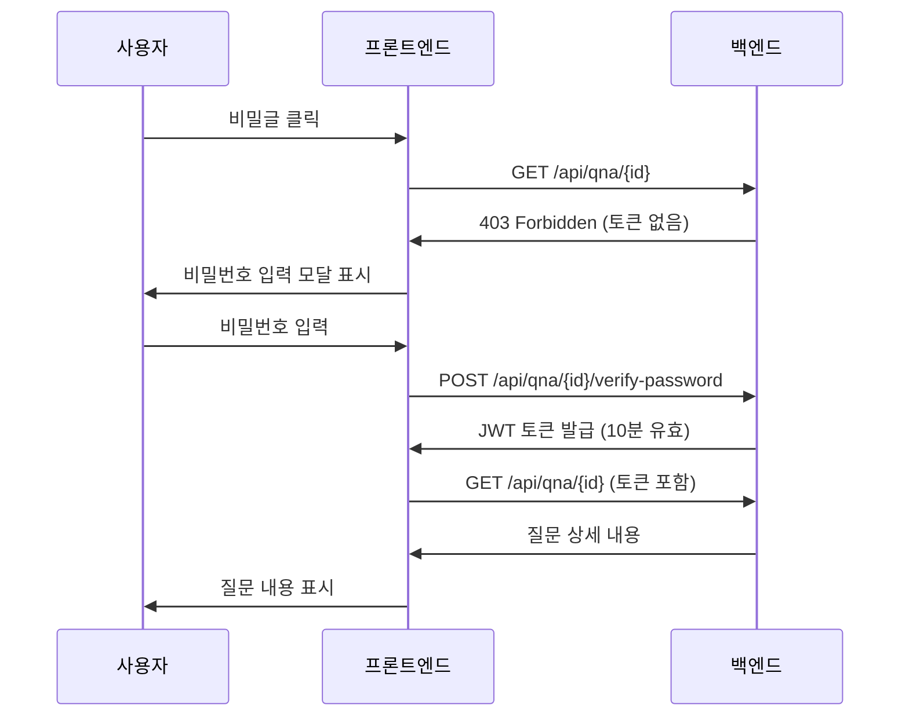

# QnA Frontend Development Guide

**최종 업데이트**: 2026.01.05  
**작성자**: Claude Code Assistant  
**목적**: QnA 도메인 프론트엔드 연동을 위한 완벽한 개발 가이드

## 🆕 최신 업데이트 (2026.01.05)

### 주요 변경사항
- **비밀글 마스킹 정책 제거**: 목록에서도 제목과 작성자명 완전 표시
- **API 경로 통일**: 모든 공개 API를 `/api/qna`로 통일
- **관리자 질문 삭제 기능 추가**: 답변 삭제뿐만 아니라 질문 자체 삭제 가능
- **이전글/다음글 네비게이션 구현**: 공개/관리자 상세 API 모두 지원
- **보안 토큰 시스템 개선**: JWT 기반 비밀글 접근 제어 강화

## 📋 목차

1. [API 엔드포인트 개요](#api-엔드포인트-개요)
2. [TypeScript 인터페이스](#typescript-인터페이스)
3. [이전글/다음글 네비게이션](#이전글다음글-네비게이션)
4. [비밀글 시스템 완벽 가이드](#비밀글-시스템-완벽-가이드)
5. [관리자 기능](#관리자-기능)
6. [React 컴포넌트 예시](#react-컴포넌트-예시)
7. [에러 처리](#에러-처리)
8. [보안 고려사항](#보안-고려사항)
9. [테스트 가이드](#테스트-가이드)

## 🌐 API 엔드포인트 개요

### 공개 API (인증 불필요)
```
GET    /api/qna                 # 질문 목록 조회
GET    /api/qna/{id}            # 질문 상세 조회 (+ 네비게이션)
POST   /api/qna                 # 질문 등록
POST   /api/qna/{id}/verify     # 비밀글 비밀번호 검증
PUT    /api/qna/{id}            # 질문 수정
DELETE /api/qna/{id}            # 질문 삭제
```

### 관리자 API (JWT 토큰 필요)
```
GET    /api/admin/qna/questions        # 관리자용 질문 목록
GET    /api/admin/qna/questions/{id}   # 관리자용 질문 상세 (+ 네비게이션)
PUT    /api/admin/qna/questions/{id}/answer  # 답변 생성/수정
DELETE /api/admin/qna/questions/{id}/answer  # 답변 삭제
DELETE /api/admin/qna/questions/{id}   # 질문 삭제 (NEW!)
```

## 🧭 이전글/다음글 네비게이션

### 네비게이션 기능 개요
모든 질문 상세 조회(공개/관리자 모두)에 자동으로 이전글/다음글 정보가 포함됩니다.

### 네비게이션 정렬 기준
- **정렬**: `createdAt DESC, id DESC` (최신순)
- **이전글**: 현재 글보다 나중에 작성된 글 중 가장 가까운 글
- **다음글**: 현재 글보다 먼저 작성된 글 중 가장 가까운 글

### 네비게이션 응답 구조
```typescript
interface QnaNavigation {
  previousQuestion: QnaNavigationItem | null;
  nextQuestion: QnaNavigationItem | null;
}

interface QnaNavigationItem {
  id: number;
  title: string;  // ⭐ 비밀글도 제목이 완전히 노출됩니다
  secret: boolean;
}
```

### 실제 API 응답 예제
```json
{
  "result": "Success",
  "code": "0000", 
  "message": "조회가 완료되었습니다.",
  "data": {
    "id": 7,
    "title": "API 경로 변경 테스트",
    "authorName": "테스트유저",
    "content": "새로운 /api/qna 경로로 질문이 잘 등록되는지 테스트합니다.",
    "createdAt": "2026-01-02 10:54:41",
    "viewCount": 2,
    "secret": false,
    "isAnswered": false,
    "answeredAt": null,
    "answer": null,
    "navigation": {
      "previousQuestion": {
        "id": 8,
        "title": "비밀글 테스트 질문",  // ⭐ 비밀글도 실제 제목 노출
        "secret": true
      },
      "nextQuestion": {
        "id": 6,
        "title": "이전 질문 제목",
        "secret": false
      }
    }
  }
}
```

### 프론트엔드 구현 예제

```tsx
const QuestionNavigation: React.FC<{ navigation: QnaNavigation }> = ({ navigation }) => {
  return (
    <div className="question-navigation">
      <div className="nav-item previous">
        {navigation.previousQuestion ? (
          <Link 
            to={`/qna/${navigation.previousQuestion.id}`}
            className="nav-link"
          >
            <span className="nav-direction">← 이전글</span>
            <span className="nav-title">
              {navigation.previousQuestion.secret && (
                <span className="secret-indicator">[비밀글] </span>
              )}
              {navigation.previousQuestion.title}
            </span>
          </Link>
        ) : (
          <span className="nav-disabled">
            <span className="nav-direction">← 이전글</span>
            <span className="nav-title">이전글이 없습니다</span>
          </span>
        )}
      </div>

      <div className="nav-divider">|</div>

      <div className="nav-item next">
        {navigation.nextQuestion ? (
          <Link 
            to={`/qna/${navigation.nextQuestion.id}`}
            className="nav-link"
          >
            <span className="nav-direction">다음글 →</span>
            <span className="nav-title">
              {navigation.nextQuestion.secret && (
                <span className="secret-indicator">[비밀글] </span>
              )}
              {navigation.nextQuestion.title}
            </span>
          </Link>
        ) : (
          <span className="nav-disabled">
            <span className="nav-direction">다음글 →</span>
            <span className="nav-title">다음글이 없습니다</span>
          </span>
        )}
      </div>
    </div>
  );
};
```

### CSS 스타일 예제
```css
.question-navigation {
  display: flex;
  margin-top: 40px;
  border-top: 1px solid #e0e0e0;
  padding-top: 20px;
}

.nav-item {
  flex: 1;
  padding: 0 10px;
}

.nav-item.previous {
  text-align: left;
}

.nav-item.next {
  text-align: right;
}

.nav-link {
  display: block;
  text-decoration: none;
  color: #333;
  transition: color 0.2s;
}

.nav-link:hover {
  color: #007bff;
}

.nav-direction {
  display: block;
  font-size: 14px;
  color: #666;
  margin-bottom: 5px;
}

.nav-title {
  display: block;
  font-weight: 500;
  line-height: 1.4;
}

.nav-disabled {
  color: #999;
  cursor: not-allowed;
}

.secret-indicator {
  color: #ff6b6b;
  font-weight: 600;
}

.nav-divider {
  color: #e0e0e0;
  margin: 0 20px;
  align-self: center;
}
```

## 🔐 비밀글 시스템 완벽 가이드

### 비밀글이란?
- `secret: 1`로 등록된 질문
- ⭐ **목록에서 제목/작성자 완전 노출** (더 이상 마스킹 안함)
- 상세 내용 조회 시에만 **비밀번호 검증 + JWT 토큰** 필요

### 비밀글 접근 플로우



### 🔑 비밀글 처리 단계별 가이드

#### 1단계: 비밀글 감지
```javascript
const handleQuestionClick = (question) => {
  if (question.secret) {
    // 비밀글인 경우: 토큰 확인 후 비밀번호 입력 요구
    const token = getSecretQuestionToken(question.id);
    if (!token || isTokenExpired(token)) {
      showPasswordModal(question.id);
      return;
    }
  }
  // 공개글이거나 유효한 토큰이 있는 경우: 바로 조회
  fetchQuestionDetail(question.id);
};
```

#### 2단계: 비밀번호 검증 및 토큰 발급
```javascript
const verifyPassword = async (questionId, password) => {
  try {
    const response = await fetch(`/api/qna/${questionId}/verify-password`, {
      method: 'POST',
      headers: { 'Content-Type': 'application/json' },
      body: JSON.stringify({ password })
    });

    if (response.ok) {
      const data = await response.json();
      if (data.data.verified) {
        // 토큰 저장 (10분 유효)
        saveSecretQuestionToken(questionId, data.data.viewToken, data.data.expiresInSec);
        return data.data.viewToken;
      }
    }
    throw new Error('비밀번호가 일치하지 않습니다.');
  } catch (error) {
    handlePasswordError(error);
    return null;
  }
};
```

#### 3단계: 토큰으로 비밀글 조회
```javascript
const fetchQuestionDetail = async (questionId) => {
  const headers = { 'Content-Type': 'application/json' };
  
  // 비밀글 토큰이 있으면 헤더에 추가
  const token = getSecretQuestionToken(questionId);
  if (token) {
    headers['X-QNA-VIEW-TOKEN'] = token;
  }

  const response = await fetch(`/api/qna/${questionId}`, { headers });
  
  if (response.status === 403) {
    // 토큰이 만료되었거나 무효한 경우
    removeSecretQuestionToken(questionId);
    showPasswordModal(questionId);
    return;
  }
  
  return await response.json();
};
```

#### 4단계: 토큰 관리
```javascript
// 토큰 저장 (sessionStorage 권장 - 보안상 탭 종료시 삭제)
const saveSecretQuestionToken = (questionId, token, expiresInSec) => {
  const expireTime = Date.now() + (expiresInSec * 1000);
  sessionStorage.setItem(`qna_token_${questionId}`, JSON.stringify({
    token,
    expireTime
  }));
};

// 토큰 조회
const getSecretQuestionToken = (questionId) => {
  const stored = sessionStorage.getItem(`qna_token_${questionId}`);
  if (!stored) return null;
  
  const { token, expireTime } = JSON.parse(stored);
  if (Date.now() > expireTime) {
    removeSecretQuestionToken(questionId);
    return null;
  }
  return token;
};

// 토큰 삭제
const removeSecretQuestionToken = (questionId) => {
  sessionStorage.removeItem(`qna_token_${questionId}`);
};

// 토큰 만료 확인
const isTokenExpired = (questionId) => {
  return !getSecretQuestionToken(questionId);
};
```

## 👨‍💼 관리자 기능

### 관리자 질문 삭제 (NEW! 🗑️)
```http
DELETE /api/admin/qna/questions/{id}
Authorization: Bearer {JWT_TOKEN}
```

**주요 특징**:
- 연관된 답변도 함께 삭제 (CASCADE DELETE)
- 비밀번호 검증 불필요 (관리자 권한으로 삭제)
- 삭제된 데이터는 복구 불가

**성공 응답**:
```json
{
  "result": "Success",
  "code": "0000",
  "message": "질문이 삭제되었습니다."
}
```

**프론트엔드 구현 예제**:
```javascript
const deleteQuestionByAdmin = async (questionId) => {
  if (!confirm('정말로 이 질문을 삭제하시겠습니까?\n삭제된 데이터는 복구할 수 없습니다.')) {
    return;
  }

  try {
    const response = await fetch(`/api/admin/qna/questions/${questionId}`, {
      method: 'DELETE',
      headers: {
        'Authorization': `Bearer ${adminToken}`,
        'Content-Type': 'application/json'
      }
    });

    const data = await response.json();
    
    if (data.result === 'Success') {
      alert('질문이 성공적으로 삭제되었습니다.');
      // 목록 페이지로 리다이렉트
      navigate('/admin/qna');
    } else {
      alert(data.message || '질문 삭제에 실패했습니다.');
    }
  } catch (error) {
    console.error('질문 삭제 실패:', error);
    alert('오류가 발생했습니다. 다시 시도해주세요.');
  }
};
```

### 관리자 질문 목록 - 비밀글 마스킹 해제
관리자가 조회하는 목록에서는 비밀글도 실제 제목과 작성자명이 완전히 표시됩니다:

```json
{
  "result": "Success",
  "items": [
    {
      "id": 8,
      "title": "비밀글 테스트 질문",      // ⭐ 실제 제목 노출
      "authorName": "비밀테스터",       // ⭐ 실제 작성자 노출
      "phoneNumber": "010-8765-4321",
      "createdAt": "2026-01-02 10:54:58",
      "viewCount": 1,
      "isAnswered": false,
      "secret": true,
      "privacyConsent": true,
      "ipAddress": "0:0:0:0:0:0:0:1"
    }
  ],
  "total": 8,
  "page": 0,
  "size": 20
}
```

## 🔧 TypeScript 인터페이스

```typescript
// 기본 응답 타입
interface ApiResponse<T = any> {
  result: 'Success' | 'Error';
  code?: string;
  message?: string;
  accessDenied?: boolean;
  data?: T;
  isNeedLogin?: boolean;
}

interface ListApiResponse<T> extends ApiResponse {
  items: T[];
  total: number;
  page: number;
  size: number;
}

// 네비게이션 타입 (NEW!)
interface QnaNavigation {
  previousQuestion: QnaNavigationItem | null;
  nextQuestion: QnaNavigationItem | null;
}

interface QnaNavigationItem {
  id: number;
  title: string;  // ⭐ 비밀글도 제목 노출
  secret: boolean;
}

// QnA 질문 관련 타입
interface QnaQuestionListItem {
  id: number;
  title: string;      // ⭐ 비밀글도 실제 제목 노출
  authorName: string; // ⭐ 비밀글도 실제 작성자 노출
  createdAt: string;
  viewCount: number;
  isAnswered: boolean;
  answeredAt: string | null;
  secret: boolean;
}

interface QnaQuestionDetail {
  id: number;
  title: string;
  authorName: string;
  content: string;
  createdAt: string;
  viewCount: number;
  secret: boolean;
  isAnswered: boolean;
  answeredAt: string | null;
  answer: QnaAnswer | null;
  navigation: QnaNavigation; // ⭐ 네비게이션 정보 추가
}

interface QnaAnswer {
  id: number;
  content: string;
  createdBy: number;
  createdAt: string;
  updatedAt: string;
}

// 관리자용 상세 타입
interface QnaQuestionAdminDetail extends QnaQuestionDetail {
  phoneNumber: string;
  privacyConsent: boolean;
  ipAddress: string;
  navigation: QnaNavigation; // ⭐ 관리자도 네비게이션 지원
}

interface QnaQuestionAdminListItem extends QnaQuestionListItem {
  phoneNumber: string;
  privacyConsent: boolean;
  ipAddress: string;
}

// 요청 타입
interface CreateQuestionRequest {
  authorName: string;
  phoneNumber: string;
  title: string;
  content: string;
  password: string;
  secret?: number; // 0 or 1
  privacyConsent: number; // 0 or 1
}

interface UpdateQuestionRequest {
  title: string;
  content: string;
  password: string;
  secret?: number;
}

interface VerifyPasswordRequest {
  password: string;
}

interface VerifyPasswordResponse {
  verified: boolean;
  viewToken?: string;
  expiresInSec?: number;
}

interface CreateAnswerRequest {
  content: string;
}

// 검색 필터 타입
interface QuestionFilters {
  isAnswered?: number;
  searchType?: 'title' | 'content' | 'author_name' | 'all';
  keyword?: string;
  page?: number;
  size?: number;
}

interface AdminQuestionFilters extends QuestionFilters {
  secret?: number;
  fromDate?: string;
  toDate?: string;
}
```

## ⚛️ React 컴포넌트 예시

### 1. 질문 목록 컴포넌트 (마스킹 해제 반영)

```tsx
import React, { useState, useEffect } from 'react';

interface QuestionListProps {
  filters?: QuestionFilters;
}

const QuestionList: React.FC<QuestionListProps> = ({ filters = {} }) => {
  const [questions, setQuestions] = useState<QnaQuestionListItem[]>([]);
  const [loading, setLoading] = useState(false);
  const [pagination, setPagination] = useState({
    total: 0,
    page: 0,
    size: 20
  });

  const fetchQuestions = async (currentFilters: QuestionFilters) => {
    setLoading(true);
    try {
      const params = new URLSearchParams();
      
      if (currentFilters.isAnswered !== undefined) {
        params.append('isAnswered', currentFilters.isAnswered.toString());
      }
      if (currentFilters.searchType) {
        params.append('searchType', currentFilters.searchType);
      }
      if (currentFilters.keyword) {
        params.append('keyword', currentFilters.keyword);
      }
      if (currentFilters.page !== undefined) {
        params.append('page', currentFilters.page.toString());
      }
      if (currentFilters.size !== undefined) {
        params.append('size', currentFilters.size.toString());
      }

      const response = await fetch(`/api/qna?${params}`);
      const data: ListApiResponse<QnaQuestionListItem> = await response.json();
      
      if (data.result === 'Success') {
        setQuestions(data.items);
        setPagination({
          total: data.total,
          page: data.page,
          size: data.size
        });
      }
    } catch (error) {
      console.error('질문 목록 조회 실패:', error);
    } finally {
      setLoading(false);
    }
  };

  useEffect(() => {
    fetchQuestions(filters);
  }, [filters]);

  const handleQuestionClick = (question: QnaQuestionListItem) => {
    if (question.secret) {
      // 비밀글 처리 로직 (별도 컴포넌트에서 구현)
      handleSecretQuestion(question.id);
    } else {
      // 공개글은 바로 상세 페이지로
      navigateToDetail(question.id);
    }
  };

  if (loading) return <div>로딩 중...</div>;

  return (
    <div className="question-list">
      <div className="question-count">
        전체 {pagination.total}개의 질문
      </div>
      
      {questions.map(question => (
        <div 
          key={question.id} 
          className={`question-item ${question.secret ? 'secret' : ''}`}
          onClick={() => handleQuestionClick(question)}
        >
          <div className="question-header">
            <h3 className="question-title">
              {question.secret && <span className="secret-badge">[비밀글]</span>}
              {question.title}  {/* ⭐ 비밀글도 실제 제목이 표시됩니다 */}
            </h3>
            <span className="question-status">
              {question.isAnswered ? '답변완료' : '답변대기'}
            </span>
          </div>
          
          <div className="question-meta">
            <span className="author">{question.authorName}</span> {/* ⭐ 비밀글도 실제 작성자명 표시 */}
            <span className="date">{question.createdAt}</span>
            <span className="views">조회 {question.viewCount}</span>
          </div>
        </div>
      ))}

      <Pagination 
        current={pagination.page}
        total={pagination.total}
        pageSize={pagination.size}
        onChange={(page) => fetchQuestions({ ...filters, page })}
      />
    </div>
  );
};
```

### 2. 질문 상세 조회 컴포넌트 (네비게이션 포함)

```tsx
import React, { useState, useEffect } from 'react';

interface QuestionDetailProps {
  questionId: number;
}

const QuestionDetail: React.FC<QuestionDetailProps> = ({ questionId }) => {
  const [question, setQuestion] = useState<QnaQuestionDetail | null>(null);
  const [loading, setLoading] = useState(false);
  const [showPasswordModal, setShowPasswordModal] = useState(false);

  const fetchQuestionDetail = async (token?: string) => {
    setLoading(true);
    
    try {
      const headers: HeadersInit = { 'Content-Type': 'application/json' };
      
      // 토큰이 있으면 헤더에 추가
      if (token) {
        headers['X-QNA-VIEW-TOKEN'] = token;
      } else {
        // 저장된 토큰 확인
        const savedToken = getSecretQuestionToken(questionId);
        if (savedToken) {
          headers['X-QNA-VIEW-TOKEN'] = savedToken;
        }
      }

      const response = await fetch(`/api/qna/${questionId}`, { headers });
      
      if (response.status === 403) {
        // 비밀글 접근 권한 없음
        setShowPasswordModal(true);
        return;
      }

      if (response.ok) {
        const data: ApiResponse<QnaQuestionDetail> = await response.json();
        if (data.result === 'Success') {
          setQuestion(data.data!);
        }
      }
    } catch (error) {
      console.error('질문 조회 실패:', error);
    } finally {
      setLoading(false);
    }
  };

  useEffect(() => {
    fetchQuestionDetail();
  }, [questionId]);

  const handlePasswordSuccess = (token: string) => {
    fetchQuestionDetail(token);
  };

  if (loading) return <div>로딩 중...</div>;
  if (!question) return null;

  return (
    <>
      <div className="question-detail">
        <div className="question-header">
          <h1 className="question-title">
            {question.secret && <span className="secret-badge">[비밀글]</span>}
            {question.title}
          </h1>
          
          <div className="question-meta">
            <div className="author-info">
              <span className="author">{question.authorName}</span>
              <span className="date">{question.createdAt}</span>
            </div>
            <div className="question-stats">
              <span className="views">조회 {question.viewCount}</span>
              <span className={`status ${question.isAnswered ? 'answered' : 'waiting'}`}>
                {question.isAnswered ? '답변완료' : '답변대기'}
              </span>
            </div>
          </div>
        </div>

        <div className="question-content">
          {question.content}
        </div>

        {question.isAnswered && question.answer && (
          <div className="answer-section">
            <h3>답변</h3>
            <div className="answer-content">
              {question.answer.content}
            </div>
            <div className="answer-meta">
              <span className="answer-date">{question.answer.createdAt}</span>
            </div>
          </div>
        )}

        {/* ⭐ 네비게이션 섹션 NEW! */}
        <div className="question-navigation">
          <div className="nav-item prev">
            {question.navigation.previousQuestion ? (
              <Link to={`/qna/${question.navigation.previousQuestion.id}`}>
                <span className="nav-label">← 이전글</span>
                <span className="nav-title">
                  {question.navigation.previousQuestion.secret && '[비밀글] '}
                  {question.navigation.previousQuestion.title}
                </span>
              </Link>
            ) : (
              <span className="nav-disabled">이전글이 없습니다</span>
            )}
          </div>
          
          <div className="nav-item next">
            {question.navigation.nextQuestion ? (
              <Link to={`/qna/${question.navigation.nextQuestion.id}`}>
                <span className="nav-label">다음글 →</span>
                <span className="nav-title">
                  {question.navigation.nextQuestion.secret && '[비밀글] '}
                  {question.navigation.nextQuestion.title}
                </span>
              </Link>
            ) : (
              <span className="nav-disabled">다음글이 없습니다</span>
            )}
          </div>
        </div>
      </div>

      <SecretPasswordModal
        questionId={questionId}
        isOpen={showPasswordModal}
        onClose={() => setShowPasswordModal(false)}
        onSuccess={handlePasswordSuccess}
      />
    </>
  );
};
```

### 3. 관리자 질문 관리 컴포넌트 (삭제 기능 포함)

```tsx
const AdminQuestionDetail: React.FC<{ questionId: number }> = ({ questionId }) => {
  const [question, setQuestion] = useState<QnaQuestionAdminDetail | null>(null);
  const navigate = useNavigate();

  const handleDeleteQuestion = async () => {
    if (!confirm('정말로 이 질문을 삭제하시겠습니까?\n삭제된 데이터는 복구할 수 없습니다.')) {
      return;
    }

    try {
      const response = await fetch(`/api/admin/qna/questions/${questionId}`, {
        method: 'DELETE',
        headers: {
          'Authorization': `Bearer ${adminToken}`,
          'Content-Type': 'application/json'
        }
      });

      const data = await response.json();
      
      if (data.result === 'Success') {
        alert('질문이 성공적으로 삭제되었습니다.');
        navigate('/admin/qna');
      } else {
        alert(data.message || '질문 삭제에 실패했습니다.');
      }
    } catch (error) {
      console.error('질문 삭제 실패:', error);
      alert('오류가 발생했습니다. 다시 시도해주세요.');
    }
  };

  return (
    <div className="admin-question-detail">
      {/* 기본 질문 정보 표시 */}
      
      <div className="admin-actions">
        <button 
          onClick={handleDeleteQuestion} 
          className="btn btn-danger"
        >
          질문 삭제
        </button>
      </div>

      {/* ⭐ 관리자에서도 네비게이션 지원 */}
      {question?.navigation && (
        <QuestionNavigation navigation={question.navigation} />
      )}
    </div>
  );
};
```

## ⚠️ 에러 처리

### 표준 에러 코드

| 에러 코드 | 설명 | 대응 방안 |
|---|---|---|
| `QNA_QUESTION_NOT_FOUND` | 질문을 찾을 수 없음 | 목록으로 리다이렉트 |
| `QNA_SECRET_ACCESS_DENIED` | 비밀글 접근 권한 없음 | 비밀번호 입력 모달 표시 |
| `QNA_PASSWORD_MISMATCH` | 비밀번호 불일치 | 남은 시도 횟수 표시 |
| `QNA_RATE_LIMIT_EXCEEDED` | 시도 횟수 초과 | 대기 시간 안내 |
| `QNA_ANSWERED_QUESTION_MODIFICATION` | 답변 완료된 질문 수정 시도 | 수정 불가 안내 |
| `QNA_INVALID_VIEW_TOKEN` | 유효하지 않은 접근 토큰 | 토큰 삭제 후 재입력 요구 |

### 에러 처리 유틸리티

```typescript
class QnaErrorHandler {
  static handle(error: any): string {
    if (error.code) {
      switch (error.code) {
        case 'QNA_QUESTION_NOT_FOUND':
          return '질문을 찾을 수 없습니다.';
        case 'QNA_SECRET_ACCESS_DENIED':
          return '비밀글입니다. 비밀번호를 입력해주세요.';
        case 'QNA_PASSWORD_MISMATCH':
          return error.message || '비밀번호가 일치하지 않습니다.';
        case 'QNA_RATE_LIMIT_EXCEEDED':
          return error.message || '너무 많은 시도로 인해 잠시 후에 다시 시도해주세요.';
        case 'QNA_ANSWERED_QUESTION_MODIFICATION':
          return '답변이 완료된 질문은 수정할 수 없습니다.';
        case 'QNA_INVALID_VIEW_TOKEN':
          return '접근 권한이 만료되었습니다. 다시 비밀번호를 입력해주세요.';
        default:
          return error.message || '알 수 없는 오류가 발생했습니다.';
      }
    }
    return '네트워크 오류가 발생했습니다. 다시 시도해주세요.';
  }

  static shouldRetry(error: any): boolean {
    return !['QNA_RATE_LIMIT_EXCEEDED', 'QNA_QUESTION_NOT_FOUND'].includes(error.code);
  }

  static isAuthError(error: any): boolean {
    return ['QNA_SECRET_ACCESS_DENIED', 'QNA_INVALID_VIEW_TOKEN'].includes(error.code);
  }
}
```

## 🔒 보안 고려사항

### 1. 비밀글 토큰 관리
- **저장 위치**: sessionStorage 사용 (탭 종료시 자동 삭제)
- **만료 시간**: 10분 (서버에서 설정)
- **자동 갱신**: 만료 시 자동으로 토큰 삭제

```javascript
// 보안을 위한 토큰 관리 Best Practice
const TokenManager = {
  save: (questionId, token, expiresInSec) => {
    // sessionStorage 사용으로 탭 종료시 자동 삭제
    const data = {
      token,
      expireTime: Date.now() + (expiresInSec * 1000),
      questionId // 검증용
    };
    sessionStorage.setItem(`qna_token_${questionId}`, JSON.stringify(data));
  },

  get: (questionId) => {
    const stored = sessionStorage.getItem(`qna_token_${questionId}`);
    if (!stored) return null;

    try {
      const data = JSON.parse(stored);
      
      // 만료 시간 확인
      if (Date.now() > data.expireTime) {
        TokenManager.remove(questionId);
        return null;
      }

      // questionId 일치 확인 (보안 강화)
      if (data.questionId !== questionId) {
        TokenManager.remove(questionId);
        return null;
      }

      return data.token;
    } catch {
      TokenManager.remove(questionId);
      return null;
    }
  },

  remove: (questionId) => {
    sessionStorage.removeItem(`qna_token_${questionId}`);
  },

  clear: () => {
    // 모든 QnA 토큰 삭제
    Object.keys(sessionStorage)
      .filter(key => key.startsWith('qna_token_'))
      .forEach(key => sessionStorage.removeItem(key));
  }
};
```

### 2. Rate Limiting 대응
```javascript
const RateLimitHandler = {
  async handlePasswordVerification(questionId, password) {
    try {
      const response = await fetch(`/api/qna/${questionId}/verify-password`, {
        method: 'POST',
        headers: { 'Content-Type': 'application/json' },
        body: JSON.stringify({ password })
      });

      const data = await response.json();

      if (data.result === 'Success') {
        if (data.data.verified) {
          return { success: true, token: data.data.viewToken, expiresInSec: data.data.expiresInSec };
        } else {
          return { success: false, message: data.message };
        }
      }
    } catch (error) {
      if (error.code === 'QNA_RATE_LIMIT_EXCEEDED') {
        // Rate limit 처리
        return {
          success: false,
          isRateLimited: true,
          message: error.message
        };
      }
      throw error;
    }
  }
};
```

### 3. 입력값 검증
```javascript
const Validators = {
  phoneNumber: (value) => {
    return /^[0-9]{10,11}$/.test(value);
  },

  password: (value) => {
    return value.length >= 4 && value.length <= 20;
  },

  authorName: (value) => {
    return value.trim().length > 0 && value.length <= 100;
  },

  title: (value) => {
    return value.trim().length > 0 && value.length <= 255;
  },

  content: (value) => {
    return value.trim().length > 0 && value.length <= 5000;
  }
};
```

## ❓ FAQ & 트러블슈팅

### Q1: 비밀글 토큰이 계속 만료되는 문제
**A**: 토큰 유효시간은 10분입니다. 다음을 확인해보세요:
- 시스템 시간이 정확한지 확인
- 토큰 저장/조회 로직에 오류가 없는지 확인
- 서버와 클라이언트 시간 동기화 확인

### Q2: Rate Limiting 에러가 자주 발생하는 문제
**A**: IP당 5회 실패 후 1시간 제한됩니다:
- 개발 중에는 서버 재시작으로 초기화 가능
- 운영 환경에서는 시간이 지나면 자동 해제
- 비밀번호 입력 UI에 명확한 안내 메시지 추가

### Q3: 네비게이션에서 비밀글 클릭 시 처리
**A**: 네비게이션의 비밀글도 일반 비밀글과 동일하게 처리:
- 제목은 보이지만 클릭 시 비밀번호 검증 필요
- 토큰이 있으면 바로 이동, 없으면 비밀번호 입력 모달

### Q4: 관리자 질문 삭제 시 주의사항
**A**: 다음 사항을 반드시 확인:
- 삭제 전 확인 모달 표시 (복구 불가 안내)
- 연관된 답변도 함께 삭제됨을 사용자에게 안내
- 삭제 후 목록 페이지로 리다이렉트

### 개발 팁

1. **네비게이션 테스트**:
```bash
# 질문 상세 조회에 네비게이션이 포함되는지 확인
curl -X GET "http://localhost:8081/api/qna/7"
```

2. **관리자 질문 삭제 테스트**:
```bash
# 관리자 토큰으로 질문 삭제
curl -X DELETE "http://localhost:8081/api/admin/qna/questions/8" \
  -H "Authorization: Bearer YOUR_ADMIN_TOKEN"
```

3. **비밀글 마스킹 해제 확인**:
```bash
# 목록에서 비밀글 제목과 작성자가 실제로 표시되는지 확인
curl -X GET "http://localhost:8081/api/qna"
```

---

## 🎉 마무리

이 명세서를 참고하여 QnA 시스템을 구현하시면 됩니다. 특히 다음 **최신 변경사항**에 주의를 기울여 구현해주세요:

### 🔥 핵심 포인트
1. **비밀글 마스킹 해제**: 목록에서도 실제 제목과 작성자명 표시
2. **통일된 API 경로**: 모든 공개 API는 `/api/qna` 사용
3. **완전한 네비게이션**: 모든 상세 조회에 이전글/다음글 정보 포함
4. **관리자 질문 삭제**: 답변뿐만 아니라 질문 자체도 삭제 가능

추가 질문이나 구현 중 문제가 발생하면 언제든 문의해주세요! 🚀

**마지막 업데이트**: 2026.01.05  
**API Version**: 2.0 (네비게이션 추가)  
**Base URL**: http://localhost:8081