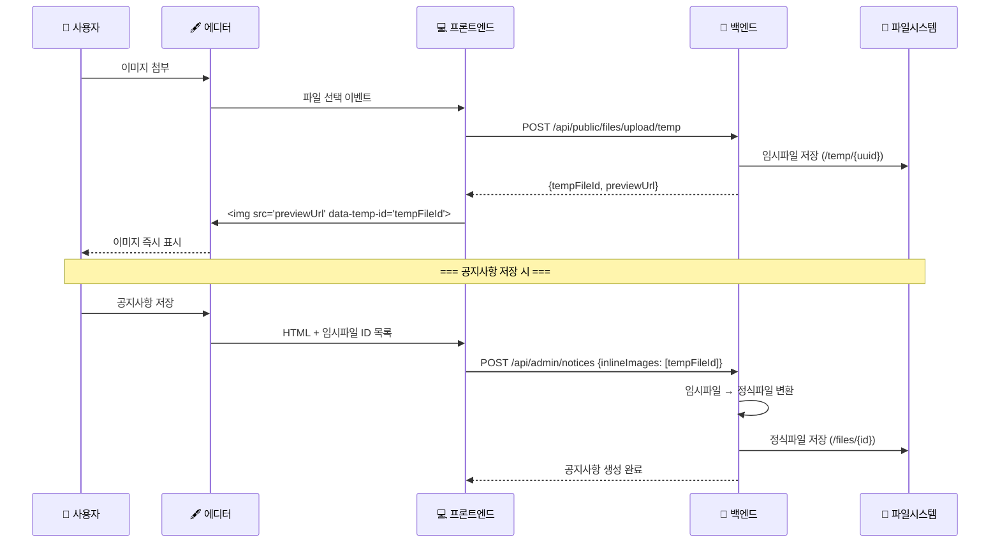

# 📁 File Management System Guide

## 🎯 개요

Academy API Server의 파일 관리 시스템은 **임시파일 → 정식파일 → 연결관리** 3단계 구조로 설계되어 있습니다.
이 가이드는 NoticeService의 완벽한 파일 처리 구현을 분석하여 다른 도메인에서 파일 기능을 구현할 때 참고할 수 있도록 정리했습니다.

## 🏗️ 파일 시스템 아키텍처

```
┌─────────────┐    ┌─────────────┐    ┌─────────────────┐
│ 임시파일     │ →  │ 정식파일     │ →  │ 파일연결        │
│ (temp)      │    │ (formal)    │    │ (links)         │
├─────────────┤    ├─────────────┤    ├─────────────────┤
│ String UUID │    │ Long ID     │    │ UploadFileLink  │
│ /temp/      │    │ /files/     │    │ owner_table     │
│ 1시간 TTL   │    │ 영구 보관    │    │ owner_id        │
└─────────────┘    └─────────────┘    └─────────────────┘
```

### 📊 주요 테이블 구조

#### 1. upload_files (정식파일 메타데이터)
```sql
CREATE TABLE upload_files (
    id BIGINT PRIMARY KEY,
    server_path VARCHAR(500) NOT NULL,    -- 실제 저장 경로
    file_name VARCHAR(255) NOT NULL,      -- 서버 파일명
    original_name VARCHAR(255),           -- 사용자 업로드 원본명
    mime_type VARCHAR(100),
    ext VARCHAR(20),
    size BIGINT NOT NULL,
    created_at TIMESTAMP NOT NULL
);
```

#### 2. upload_file_links (다형성 파일 연결)
```sql
CREATE TABLE upload_file_links (
    id BIGINT PRIMARY KEY,
    file_id BIGINT NOT NULL,              -- upload_files.id FK
    owner_table VARCHAR(80) NOT NULL,     -- 소유 테이블명 ("notices", "facility" 등)
    owner_id BIGINT NOT NULL,             -- 소유 엔티티 ID
    role VARCHAR(40) NOT NULL,            -- 파일 역할 (ATTACHMENT, INLINE, COVER)
    sort_order INT DEFAULT 0,
    created_at TIMESTAMP NOT NULL,
    
    UNIQUE(owner_table, owner_id, file_id, role),
    INDEX idx_ufl_owner(owner_table, owner_id),
    INDEX idx_ufl_file(file_id)
);
```

### 🎭 FileRole 열거형
```java
public enum FileRole {
    ATTACHMENT,    // 첨부파일 (공지사항, 문서 등)
    INLINE,        // 본문 이미지 (에디터 삽입 이미지)
    COVER,         // 커버/대표 이미지 (시설, 갤러리 등)
    THUMBNAIL      // 썸네일 이미지
}
```

## 📝 구현 패턴

### 🔧 1. 필수 의존성 설정

#### Service 의존성
```java
@Service
@RequiredArgsConstructor
@Transactional(readOnly = true)
public class DomainServiceImpl implements DomainService {
    
    // 필수 의존성
    private final UploadFileLinkRepository uploadFileLinkRepository;
    private final FileService fileService;
    
    // 도메인 관련 의존성
    private final DomainRepository domainRepository;
    private final DomainMapper domainMapper;
}
```

#### Repository 의존성 (Mapper 사용 시)
```java
@Component
@RequiredArgsConstructor
public class DomainMapper {
    
    private final UploadFileLinkRepository uploadFileLinkRepository;
    private final UploadFileRepository uploadFileRepository;
}
```

### 📥 2. Request DTO 설계

#### 단일 파일 (예: 시설 커버 이미지)
```java
@Getter
@Setter
@NoArgsConstructor
@Schema(description = "시설 생성 요청")
public class RequestFacilityCreate {
    
    @NotBlank(message = "시설명을 입력해주세요")
    @Schema(description = "시설명", requiredMode = Schema.RequiredMode.REQUIRED)
    private String title;
    
    @Schema(description = "커버 이미지 파일 ID (임시파일)", example = "uuid-abc123")
    private String coverImageFileId;
    
    @Schema(description = "공개 여부", example = "true", defaultValue = "true")
    private Boolean isPublished = true;
}
```

#### 다중 파일 (예: 공지사항)
```java
@Getter
@Setter
@NoArgsConstructor
@Schema(description = "공지사항 생성 요청")
public class RequestNoticeCreate {
    
    @NotBlank(message = "제목을 입력해주세요")
    @Schema(description = "제목", requiredMode = Schema.RequiredMode.REQUIRED)
    private String title;
    
    @Schema(description = "첨부파일 ID 목록 (임시파일)", example = "[\"uuid-a\", \"uuid-b\"]")
    private List<String> attachments;
    
    @Schema(description = "본문 이미지 ID 목록 (임시파일)", example = "[\"uuid-c\"]")
    private List<String> inlineImages;
}
```

### 📤 3. Response DTO 설계

#### 단일 파일 응답
```java
@Getter
@Builder
@Schema(description = "시설 상세 응답")
public class ResponseFacility {
    
    @Schema(description = "시설 ID", example = "1")
    private Long id;
    
    @Schema(description = "시설명", example = "최신식 과학 실험실")
    private String title;
    
    @Schema(description = "커버 이미지 정보")
    private UploadFileDto coverImage;
}
```

#### 다중 파일 응답
```java
@Getter
@Builder
@Schema(description = "공지사항 상세 응답")
public class ResponseNotice {
    
    @Schema(description = "공지사항 ID", example = "1")
    private Long id;
    
    @Schema(description = "제목", example = "새로운 학사일정 안내")
    private String title;
    
    @Schema(description = "첨부파일 목록")
    private List<ResponseFileInfo> attachments;
    
    @Schema(description = "본문 이미지 목록")
    private List<ResponseFileInfo> inlineImages;
}
```

#### 파일 정보 응답 DTO
```java
@Getter
@Builder
@Schema(description = "파일 정보 응답")
public class ResponseFileInfo {
    
    @Schema(description = "파일 ID", example = "123")
    private String fileId;
    
    @Schema(description = "파일명", example = "document.pdf")
    private String fileName;
    
    @Schema(description = "파일 확장자", example = "pdf")
    private String ext;
    
    @Schema(description = "파일 크기 (bytes)", example = "123456")
    private Long size;
    
    @Schema(description = "다운로드 URL", example = "/api/public/files/download/123")
    private String url;
}
```

### 💾 4. 엔티티 설계

#### UploadFileLink Factory 메서드 추가
```java
@Entity
public class UploadFileLink {
    
    // 기존 필드들...
    
    /**
     * 도메인별 파일 연결 생성 팩토리 메서드.
     */
    
    // 시설 커버 이미지
    public static UploadFileLink createFacilityCoverImage(Long fileId, Long facilityId) {
        return UploadFileLink.builder()
                .fileId(fileId)
                .ownerTable("facility")
                .ownerId(facilityId)
                .role(FileRole.COVER)
                .sortOrder(0)
                .build();
    }
    
    // 갤러리 이미지
    public static UploadFileLink createGalleryImage(Long fileId, Long galleryId) {
        return UploadFileLink.builder()
                .fileId(fileId)
                .ownerTable("gallery")
                .ownerId(galleryId)
                .role(FileRole.COVER)
                .sortOrder(0)
                .build();
    }
    
    // 공지사항 첨부파일 (이미 존재)
    public static UploadFileLink createNoticeAttachment(Long fileId, Long noticeId) {
        return UploadFileLink.builder()
                .fileId(fileId)
                .ownerTable("notices")
                .ownerId(noticeId)
                .role(FileRole.ATTACHMENT)
                .sortOrder(0)
                .build();
    }
}
```

## 🚀 Service 구현 패턴

### ✨ 1. 생성 (CREATE) - 단일 파일

```java
@Override
@Transactional
public ResponseData<Long> createFacility(RequestFacilityCreate request) {
    log.info("[FacilityService] 시설 생성 시작. title={}, coverImageFileId={}", 
            request.getTitle(), request.getCoverImageFileId());
    
    // 1. 엔티티 생성 및 저장
    Facility facility = facilityMapper.toEntity(request);
    Facility savedFacility = facilityRepository.save(facility);
    
    // 2. 커버 이미지 파일 연결 (있는 경우만)
    if (request.getCoverImageFileId() != null) {
        linkSingleFile(savedFacility.getId(), request.getCoverImageFileId(), 
                      "facility", FileRole.COVER);
    }
    
    log.info("[FacilityService] 시설 생성 완료. id={}", savedFacility.getId());
    
    return ResponseData.ok("0000", "시설이 생성되었습니다.", savedFacility.getId());
}

/**
 * 단일 파일 연결 도우미 메서드.
 */
private void linkSingleFile(Long ownerId, String tempFileId, String ownerTable, FileRole role) {
    log.debug("[FacilityService] 파일 연결 시작. ownerId={}, tempFileId={}, role={}", 
             ownerId, tempFileId, role);
    
    // 임시파일 → 정식파일 변환
    Long formalFileId = fileService.promoteToFormalFile(tempFileId, 
                                                       extractOriginalFileName(tempFileId));
    if (formalFileId == null) {
        log.warn("[FacilityService] 파일 변환 실패. tempFileId={}", tempFileId);
        return;
    }
    
    // 파일 연결 생성
    UploadFileLink fileLink = UploadFileLink.createFacilityCoverImage(formalFileId, ownerId);
    uploadFileLinkRepository.save(fileLink);
    
    log.debug("[FacilityService] 파일 연결 완료. tempId={} -> formalId={}", tempFileId, formalFileId);
}

/**
 * 파일명 추출 도우미 메서드.
 */
private String extractOriginalFileName(String fileId) {
    try {
        var fileInfoResponse = fileService.getFileInfo(fileId);
        if (fileInfoResponse.getData() != null) {
            return fileInfoResponse.getData().getOriginalFileName();
        }
    } catch (Exception e) {
        log.warn("[FacilityService] 파일 정보 조회 실패. fileId={}", fileId);
    }
    return fileId + ".tmp";
}
```

### ✨ 2. 생성 (CREATE) - 다중 파일

```java
@Override
@Transactional
public ResponseData<Long> createNotice(RequestNoticeCreate request) {
    log.info("[NoticeService] 공지사항 생성 시작. title={}, attachments={}개, inlineImages={}개", 
            request.getTitle(), 
            request.getAttachments() != null ? request.getAttachments().size() : 0,
            request.getInlineImages() != null ? request.getInlineImages().size() : 0);
    
    // 1. 엔티티 생성 및 저장
    Notice notice = noticeMapper.toEntity(request);
    Notice savedNotice = noticeRepository.save(notice);
    
    // 2. 파일 연결 처리
    linkMultipleFiles(savedNotice.getId(), request.getAttachments(), 
                     "notices", FileRole.ATTACHMENT);
    linkMultipleFiles(savedNotice.getId(), request.getInlineImages(), 
                     "notices", FileRole.INLINE);
    
    log.info("[NoticeService] 공지사항 생성 완료. id={}", savedNotice.getId());
    
    return ResponseData.ok("0000", "공지사항이 생성되었습니다.", savedNotice.getId());
}

/**
 * 다중 파일 연결 도우미 메서드.
 */
private void linkMultipleFiles(Long ownerId, List<String> fileIds, String ownerTable, FileRole role) {
    if (fileIds == null || fileIds.isEmpty()) {
        log.debug("[NoticeService] 연결할 {}파일 없음. ownerId={}", role, ownerId);
        return;
    }

    log.info("[NoticeService] {} 파일 연결 생성 시작. ownerId={}, 파일개수={}", role, ownerId, fileIds.size());

    // 임시 파일 ID를 정식 파일 ID로 변환하는 Map
    Map<String, Long> tempToFormalIdMap = new HashMap<>();
    
    // 1단계: 모든 임시 파일을 정식 파일로 변환
    for (String tempFileId : fileIds) {
        Long formalFileId = fileService.promoteToFormalFile(tempFileId, extractOriginalFileName(tempFileId));
        if (formalFileId != null) {
            tempToFormalIdMap.put(tempFileId, formalFileId);
            log.debug("[NoticeService] 임시 파일 정식 변환 성공. tempId={} -> formalId={}", tempFileId, formalFileId);
        } else {
            log.warn("[NoticeService] 임시 파일 변환 실패로 연결 생략. tempFileId={}, role={}", tempFileId, role);
        }
    }

    // 2단계: 성공한 변환들에 대해 파일 연결 객체 생성
    List<UploadFileLink> successfulLinks = tempToFormalIdMap.values().stream()
            .map(formalFileId -> {
                if (role == FileRole.ATTACHMENT) {
                    return UploadFileLink.createNoticeAttachment(formalFileId, ownerId);
                } else {
                    return UploadFileLink.createNoticeInlineImage(formalFileId, ownerId);
                }
            })
            .toList();

    // 3단계: DB에 파일 연결 저장
    if (!successfulLinks.isEmpty()) {
        uploadFileLinkRepository.saveAll(successfulLinks);
    }
    
    log.info("[NoticeService] {} 파일 연결 생성 완료. ownerId={}, 요청={}개, 성공={}개", 
            role, ownerId, fileIds.size(), successfulLinks.size());
}
```

### 🔍 3. 조회 (READ) - Mapper에서 구현

#### Mapper에서 단일 파일 조회
```java
@Component
@RequiredArgsConstructor
public class FacilityMapper {
    
    private final UploadFileLinkRepository uploadFileLinkRepository;
    private final UploadFileRepository uploadFileRepository;
    
    /**
     * Entity → Response DTO 변환 (파일 정보 포함).
     */
    public ResponseFacility toResponse(Facility entity) {
        if (entity == null) {
            return null;
        }

        return ResponseFacility.builder()
                .id(entity.getId())
                .title(entity.getTitle())
                .isPublished(entity.getIsPublished())
                .coverImage(getLinkedFile("facility", entity.getId(), FileRole.COVER))
                .createdBy(entity.getCreatedBy())
                .createdAt(entity.getCreatedAt())
                .updatedBy(entity.getUpdatedBy())
                .updatedAt(entity.getUpdatedAt())
                .build();
    }
    
    /**
     * 연결된 파일 정보 조회.
     */
    private UploadFileDto getLinkedFile(String ownerTable, Long ownerId, FileRole role) {
        List<UploadFileLink> links = uploadFileLinkRepository.findByOwnerTableAndOwnerIdAndRole(
                ownerTable, ownerId, role);
        
        if (links.isEmpty()) {
            return null;
        }
        
        // 첫 번째 링크의 파일 정보 조회
        Long fileId = links.get(0).getFileId();
        return uploadFileRepository.findById(fileId)
                .map(file -> UploadFileDto.builder()
                        .id(file.getId().toString())
                        .groupKey(null) // UploadFile에 groupKey 필드 없음
                        .fileName(file.getFileName())
                        .ext(file.getExt())
                        .size(file.getSize())
                        .regDate(file.getCreatedAt())
                        .downloadUrl("/api/public/files/download/" + file.getId())
                        .build())
                .orElse(null);
    }
}
```

#### Service에서 다중 파일 조회 (JOIN 활용)
```java
/**
 * 공지사항 상세 조회 (파일 목록 포함).
 */
public ResponseData<ResponseNotice> getNoticeWithFiles(Long id) {
    log.info("[NoticeService] 공지사항 상세 조회 시작. ID={}", id);
    
    Notice notice = findNoticeById(id);
    
    // 1. 첨부파일 목록 조회 (JOIN 쿼리 활용)
    List<Object[]> attachmentData = uploadFileLinkRepository.findFileInfosByOwnerAndRole(
            "notices", id, FileRole.ATTACHMENT);
    
    List<ResponseFileInfo> attachments = attachmentData.stream()
            .map(this::mapToResponseFileInfo)
            .toList();
    
    // 2. 본문 이미지 목록 조회
    List<Object[]> inlineImageData = uploadFileLinkRepository.findFileInfosByOwnerAndRole(
            "notices", id, FileRole.INLINE);
    
    List<ResponseFileInfo> inlineImages = inlineImageData.stream()
            .map(this::mapToResponseFileInfo)
            .toList();
    
    // 3. ResponseNotice 생성 (파일 목록 포함)
    ResponseNotice response = ResponseNotice.builder()
            .id(notice.getId())
            .title(notice.getTitle())
            .content(notice.getContent())
            .attachments(attachments)
            .inlineImages(inlineImages)
            .build();
    
    return ResponseData.ok(response);
}

/**
 * Object[] → ResponseFileInfo 변환.
 * Object[] = [fileId, fileName, ext, size, serverPath]
 */
private ResponseFileInfo mapToResponseFileInfo(Object[] row) {
    return ResponseFileInfo.builder()
            .fileId(String.valueOf(row[0]))  // Long → String 변환
            .fileName((String) row[1])
            .ext((String) row[2])
            .size((Long) row[3])
            .url("/api/public/files/download/" + row[0])  // 다운로드 URL 생성
            .build();
}
```

#### 목록 조회 성능 최적화 (파일 개수만 조회)
```java
/**
 * 공지사항 목록 조회 (파일 개수 포함).
 */
public ResponseList<ResponseNoticeListItem> getNoticeListWithFileCount(
        RequestNoticeSearch searchCondition, Pageable pageable) {
    
    log.info("[NoticeService] 공지사항 목록 조회 시작");
    
    // 1. 공지사항 목록 조회
    Page<Notice> noticePage = noticeRepository.searchNotices(searchCondition, pageable);
    List<Notice> notices = noticePage.getContent();
    
    if (notices.isEmpty()) {
        return ResponseList.ok(ResponseNoticeListItem.fromList(notices),
                              noticePage.getTotalElements(),
                              noticePage.getNumber(),
                              noticePage.getSize());
    }
    
    // 2. 공지사항 ID 목록 추출
    List<Long> noticeIds = notices.stream()
            .map(Notice::getId)
            .toList();
    
    // 3. IN절을 활용한 파일 개수 일괄 조회
    List<Object[]> fileCounts = uploadFileLinkRepository.countFilesByOwnerIdsGroupByRole(
            "notices", noticeIds);
    
    // 4. Map으로 변환: noticeId -> role -> count
    Map<Long, Map<FileRole, Long>> fileCountMap = fileCounts.stream()
            .collect(Collectors.groupingBy(
                    row -> (Long) row[0], // ownerId
                    Collectors.toMap(
                            row -> (FileRole) row[1], // role
                            row -> (Long) row[2]      // count
                    )
            ));
    
    // 5. DTO 변환 (파일 개수 포함)
    List<ResponseNoticeListItem> items = notices.stream()
            .map(notice -> {
                Map<FileRole, Long> counts = fileCountMap.getOrDefault(notice.getId(), Map.of());
                Long attachmentCount = counts.getOrDefault(FileRole.ATTACHMENT, 0L);
                Long inlineImageCount = counts.getOrDefault(FileRole.INLINE, 0L);
                
                return ResponseNoticeListItem.from(notice)
                        .withFileCounts(attachmentCount, inlineImageCount);
            })
            .toList();
    
    return ResponseList.ok(items,
                          noticePage.getTotalElements(),
                          noticePage.getNumber(),
                          noticePage.getSize());
}
```

### ✏️ 4. 수정 (UPDATE)

#### 단일 파일 수정
```java
@Override
@Transactional
public Response updateFacility(Long id, RequestFacilityUpdate request) {
    log.info("[FacilityService] 시설 수정 시작. id={}, coverImageFileId={}", 
            id, request.getCoverImageFileId());
    
    Facility facility = findFacilityById(id);
    
    // 1. 엔티티 정보 업데이트
    facilityMapper.updateEntity(facility, request);
    
    // 2. 커버 이미지 변경 처리 (있는 경우만)
    if (request.getCoverImageFileId() != null) {
        replaceSingleFile(id, request.getCoverImageFileId(), "facility", FileRole.COVER);
    }
    
    log.info("[FacilityService] 시설 수정 완료. id={}", id);
    
    return Response.ok("0000", "시설이 수정되었습니다.");
}

/**
 * 단일 파일 치환 도우미 메서드.
 */
private void replaceSingleFile(Long ownerId, String tempFileId, String ownerTable, FileRole role) {
    // 1. DELETE: 기존 연결 삭제
    uploadFileLinkRepository.deleteByOwnerTableAndOwnerIdAndRole(ownerTable, ownerId, role);
    log.debug("[FacilityService] 기존 {} 파일 연결 삭제 완료. ownerId={}", role, ownerId);
    
    // 2. INSERT: 새로운 연결 생성
    linkSingleFile(ownerId, tempFileId, ownerTable, role);
}
```

#### 다중 파일 수정
```java
@Override
@Transactional
public Response updateNotice(Long id, RequestNoticeUpdate request) {
    log.info("[NoticeService] 공지사항 수정 시작. id={}, attachments={}개, inlineImages={}개", 
            id, 
            request.getAttachments() != null ? request.getAttachments().size() : 0,
            request.getInlineImages() != null ? request.getInlineImages().size() : 0);
    
    Notice notice = findNoticeById(id);
    
    // 1. 엔티티 업데이트
    noticeMapper.updateEntity(notice, request);
    
    // 2. 파일 치환 처리 (제공된 경우만)
    if (request.getAttachments() != null) {
        replaceMultipleFiles(id, request.getAttachments(), "notices", FileRole.ATTACHMENT);
    }
    if (request.getInlineImages() != null) {
        replaceMultipleFiles(id, request.getInlineImages(), "notices", FileRole.INLINE);
    }
    
    log.info("[NoticeService] 공지사항 수정 완료. id={}", id);
    
    return Response.ok("0000", "공지사항이 수정되었습니다.");
}

/**
 * 다중 파일 치환 도우미 메서드.
 */
private void replaceMultipleFiles(Long ownerId, List<String> fileIds, String ownerTable, FileRole role) {
    // 1. DELETE: 기존 연결 삭제
    uploadFileLinkRepository.deleteByOwnerTableAndOwnerIdAndRole(ownerTable, ownerId, role);
    log.debug("[NoticeService] 기존 {} 파일 연결 삭제 완료. ownerId={}", role, ownerId);

    // 2. INSERT: 새로운 연결 생성
    linkMultipleFiles(ownerId, fileIds, ownerTable, role);
}
```

### 🗑️ 5. 삭제 (DELETE)

```java
@Override
@Transactional
public Response deleteFacility(Long id) {
    log.info("[FacilityService] 시설 삭제 시작. id={}", id);
    
    Facility facility = findFacilityById(id);
    
    // 1. 연결된 파일 링크 삭제
    uploadFileLinkRepository.deleteByOwnerTableAndOwnerId("facility", id);
    log.debug("[FacilityService] 시설 연결 파일 해제 완료. id={}", id);
    
    // 2. 시설 엔티티 삭제
    facilityRepository.delete(facility);
    
    log.info("[FacilityService] 시설 삭제 완료. id={}, title={}", id, facility.getTitle());
    
    return Response.ok("0000", "시설이 삭제되었습니다.");
}
```

## 🔧 Repository 구현 패턴

### 📋 필수 Repository 쿼리 메서드

```java
public interface UploadFileLinkRepository extends JpaRepository<UploadFileLink, Long> {
    
    /**
     * 특정 소유자의 특정 역할 파일 연결 목록 조회.
     */
    List<UploadFileLink> findByOwnerTableAndOwnerIdAndRole(String ownerTable, Long ownerId, FileRole role);
    
    /**
     * 특정 소유자의 파일 연결 삭제 (특정 역할).
     */
    @Modifying
    @Query("DELETE FROM UploadFileLink l WHERE l.ownerTable = :ownerTable AND l.ownerId = :ownerId AND l.role = :role")
    void deleteByOwnerTableAndOwnerIdAndRole(@Param("ownerTable") String ownerTable, 
                                           @Param("ownerId") Long ownerId, 
                                           @Param("role") FileRole role);
    
    /**
     * 특정 소유자의 모든 파일 연결 삭제.
     */
    @Modifying
    @Query("DELETE FROM UploadFileLink l WHERE l.ownerTable = :ownerTable AND l.ownerId = :ownerId")
    void deleteByOwnerTableAndOwnerId(@Param("ownerTable") String ownerTable, 
                                    @Param("ownerId") Long ownerId);
    
    /**
     * 여러 소유자의 파일 개수 일괄 조회 (IN절 활용).
     * 목록 조회 성능 최적화용.
     */
    @Query("""
        SELECT l.ownerId as ownerId, 
               l.role as role, 
               COUNT(l.id) as fileCount
        FROM UploadFileLink l 
        WHERE l.ownerTable = :ownerTable 
          AND l.ownerId IN :ownerIds
        GROUP BY l.ownerId, l.role
        """)
    List<Object[]> countFilesByOwnerIdsGroupByRole(@Param("ownerTable") String ownerTable, 
                                                  @Param("ownerIds") List<Long> ownerIds);
    
    /**
     * 파일 상세 정보 조회 (JOIN 활용).
     * 단건 조회용 - 파일 정보까지 한 번에 조회.
     */
    @Query("""
        SELECT l.fileId as fileId,
               f.fileName as fileName, 
               f.ext as ext, 
               f.size as size, 
               f.serverPath as url
        FROM UploadFileLink l
        LEFT JOIN UploadFile f ON f.id = l.fileId
        WHERE l.ownerTable = :ownerTable 
          AND l.ownerId = :ownerId 
          AND l.role = :role
          AND f.id IS NOT NULL
        ORDER BY l.createdAt
        """)
    List<Object[]> findFileInfosByOwnerAndRole(@Param("ownerTable") String ownerTable,
                                              @Param("ownerId") Long ownerId, 
                                              @Param("role") FileRole role);
}
```

## 🎯 도메인별 구현 가이드

### 🏢 단일 파일 도메인 (예: Facility, Gallery)

#### 특징:
- 대표/커버 이미지 1개
- FileRole.COVER 사용
- 간단한 파일 처리
- 공지사항 대비 **단순화된 구현**

#### 구현 체크리스트:
- [ ] UploadFileLink 팩토리 메서드 추가
- [ ] Request DTO에 `String coverImageFileId` 필드
- [ ] Response DTO에 `UploadFileDto coverImage` 필드
- [ ] Mapper에서 `getLinkedFile()` 구현
- [ ] Service에서 `linkSingleFile()`, `replaceSingleFile()` 구현

#### 예시 도메인: facility, gallery, member(프로필 이미지)

---

### 🏗️ **시설 관리 시스템 - 단일 이미지 처리 완전 가이드**

시설 관리 시스템은 **1개의 대표 이미지**만 처리하므로 공지사항 대비 훨씬 단순하게 구현할 수 있습니다.

#### 🎯 **핵심 차이점: 공지사항 vs 시설**

| 구분 | 공지사항 (Notice) | 시설 (Facility) |
|------|------------------|-----------------|
| **파일 개수** | 다중 파일 (attachments, inlineImages) | **단일 파일 (coverImage)** |
| **파일 역할** | ATTACHMENT, INLINE | **COVER** |
| **Request DTO** | `List<String> attachments` | **`String coverImageFileId`** |
| **Response DTO** | `List<ResponseFileInfo>` | **`UploadFileDto coverImage`** |
| **처리 복잡도** | 높음 (파일 종류별 분리 처리) | **낮음 (단일 파일 처리)** |
| **성능 최적화** | IN절, JOIN 쿼리 필수 | **간단한 Repository 조회** |

---

#### 📋 **1단계: Service 구현 - 파일 처리 로직**

##### FacilityServiceImpl 의존성 추가
```java
@Slf4j
@Service
@RequiredArgsConstructor
@Transactional(readOnly = true)
public class FacilityServiceImpl implements FacilityService {
    
    private final FacilityRepository facilityRepository;
    private final FacilityMapper facilityMapper;
    private final UploadFileLinkRepository uploadFileLinkRepository;
    private final FileService fileService;  // 🔥 추가 필요
}
```

##### CREATE - 시설 생성 시 이미지 처리
```java
@Override
@Transactional
public ResponseData<Long> createFacility(RequestFacilityCreate request) {
    log.info("[FacilityService] 시설 생성 시작. title={}, coverImageFileId={}", 
            request.getTitle(), request.getCoverImageFileId());
    
    // 1. 엔티티 생성 및 저장
    Facility facility = facilityMapper.toEntity(request, getCurrentUserId());
    Facility savedFacility = facilityRepository.save(facility);
    
    log.debug("[FacilityService] 시설 저장 완료. id={}", savedFacility.getId());

    // 2. 커버 이미지 파일 연결 (있는 경우만)
    if (request.getCoverImageFileId() != null) {
        linkSingleFile(savedFacility.getId(), request.getCoverImageFileId());
    }
    
    log.info("[FacilityService] 시설 생성 완료. id={}, title={}", 
             savedFacility.getId(), savedFacility.getTitle());
    
    return ResponseData.ok("0000", "시설이 등록되었습니다.", savedFacility.getId());
}

/**
 * 단일 파일 연결 도우미 메서드.
 * 공지사항의 복잡한 루프 처리와 달리 단순하게 구현.
 */
private void linkSingleFile(Long facilityId, String tempFileId) {
    log.debug("[FacilityService] 커버 이미지 연결 시작. facilityId={}, tempFileId={}", 
             facilityId, tempFileId);
    
    // 1. 임시파일 → 정식파일 변환
    Long formalFileId = fileService.promoteToFormalFile(tempFileId, 
                                                       extractOriginalFileName(tempFileId));
    if (formalFileId == null) {
        log.warn("[FacilityService] 파일 변환 실패로 연결 생략. tempFileId={}", tempFileId);
        return;
    }
    
    // 2. 파일 연결 생성 (Factory 패턴 사용)
    UploadFileLink fileLink = UploadFileLink.createFacilityCoverImage(formalFileId, facilityId);
    uploadFileLinkRepository.save(fileLink);
    
    log.debug("[FacilityService] 커버 이미지 연결 완료. tempId={} -> formalId={}", 
             tempFileId, formalFileId);
}

/**
 * 파일명 추출 도우미 메서드 (공지사항과 동일).
 */
private String extractOriginalFileName(String fileId) {
    try {
        var fileInfoResponse = fileService.getFileInfo(fileId);
        if (fileInfoResponse.getData() != null) {
            return fileInfoResponse.getData().getOriginalFileName();
        }
    } catch (Exception e) {
        log.warn("[FacilityService] 파일 정보 조회 실패. fileId={}, error={}", fileId, e.getMessage());
    }
    return fileId + ".tmp";
}
```

##### UPDATE - 시설 수정 시 이미지 변경
```java
@Override
@Transactional
public Response updateFacility(Long id, RequestFacilityUpdate request, Long updatedBy) {
    log.info("[FacilityService] 시설 수정 시작. id={}, coverImageFileId={}", 
            id, request.getCoverImageFileId());
    
    return facilityRepository.findById(id)
            .map(facility -> {
                try {
                    // 1. 시설 정보 업데이트
                    facilityMapper.updateEntity(facility, request, updatedBy);
                    Facility savedFacility = facilityRepository.save(facility);
                    
                    log.debug("[FacilityService] 시설 정보 업데이트 완료. id={}", id);

                    // 2. 커버 이미지 변경 처리 (있는 경우만)
                    if (request.getCoverImageFileId() != null) {
                        replaceSingleFile(id, request.getCoverImageFileId());
                    }

                    log.info("[FacilityService] 시설 수정 완료. id={}, title={}", 
                            id, savedFacility.getTitle());
                    
                    return Response.ok("0000", "시설이 수정되었습니다.");
                } catch (Exception e) {
                    log.error("[FacilityService] 시설 수정 중 오류 발생: {}", e.getMessage(), e);
                    return Response.error("E001", "시설 수정 중 오류가 발생했습니다.");
                }
            })
            .orElseGet(() -> {
                log.warn("[FacilityService] 시설을 찾을 수 없음. id={}", id);
                return Response.error("F404", "시설을 찾을 수 없습니다.");
            });
}

/**
 * 단일 파일 치환 도우미 메서드.
 * DELETE → INSERT 패턴 (공지사항과 동일한 원리, 단순화된 구현).
 */
private void replaceSingleFile(Long facilityId, String tempFileId) {
    log.debug("[FacilityService] 커버 이미지 변경 시작. facilityId={}, newTempFileId={}", 
             facilityId, tempFileId);
    
    // 1. DELETE: 기존 커버 이미지 연결 해제
    uploadFileLinkRepository.deleteByOwnerTableAndOwnerIdAndRole("facility", facilityId, FileRole.COVER);
    log.debug("[FacilityService] 기존 커버 이미지 연결 삭제 완료. facilityId={}", facilityId);
    
    // 2. INSERT: 새로운 커버 이미지 연결
    linkSingleFile(facilityId, tempFileId);
    
    log.debug("[FacilityService] 커버 이미지 변경 완료. facilityId={}", facilityId);
}
```

##### DELETE - 시설 삭제 시 이미지 정리
```java
@Override
@Transactional
public Response deleteFacility(Long id) {
    log.info("[FacilityService] 시설 삭제 시작. id={}", id);

    return facilityRepository.findById(id)
            .map(facility -> {
                try {
                    // 1. 연결된 파일 링크 먼저 삭제 (모든 역할의 파일)
                    uploadFileLinkRepository.deleteByOwnerTableAndOwnerId("facility", id);
                    log.debug("[FacilityService] 시설 연결 파일 해제 완료. facilityId={}", id);
                    
                    // 2. 시설 엔티티 삭제
                    facilityRepository.delete(facility);
                    
                    log.info("[FacilityService] 시설 삭제 완료. id={}, title={}", 
                            id, facility.getTitle());
                    
                    return Response.ok("0000", "시설이 삭제되었습니다.");
                } catch (Exception e) {
                    log.error("[FacilityService] 시설 삭제 중 오류 발생: {}", e.getMessage(), e);
                    return Response.error("E001", "시설 삭제 중 오류가 발생했습니다.");
                }
            })
            .orElseGet(() -> {
                log.warn("[FacilityService] 삭제할 시설을 찾을 수 없음. id={}", id);
                return Response.error("F404", "시설을 찾을 수 없습니다.");
            });
}
```

---

#### 🔍 **2단계: Mapper 구현 - 파일 조회 최적화**

##### FacilityMapper 파일 정보 포함 구현
```java
@Component
@RequiredArgsConstructor
public class FacilityMapper {
    
    private final UploadFileLinkRepository uploadFileLinkRepository;
    private final UploadFileRepository uploadFileRepository;
    
    /**
     * Entity → Response DTO 변환 (커버 이미지 정보 포함).
     * 단일 파일이므로 공지사항처럼 복잡한 JOIN 쿼리 불필요.
     */
    public ResponseFacility toResponse(Facility entity) {
        if (entity == null) {
            return null;
        }

        return ResponseFacility.builder()
                .id(entity.getId())
                .title(entity.getTitle())
                .isPublished(entity.getIsPublished())
                .coverImage(getLinkedCoverImage(entity.getId()))  // 🔥 핵심 로직
                .createdBy(entity.getCreatedBy())
                .createdAt(entity.getCreatedAt())
                .updatedBy(entity.getUpdatedBy())
                .updatedAt(entity.getUpdatedAt())
                .build();
    }
    
    /**
     * Entity → List Item DTO 변환 (커버 이미지 정보 포함).
     * 목록 조회에서도 이미지 정보 제공 (단일 파일이므로 성능 문제 없음).
     */
    public ResponseFacilityListItem toListItem(Facility entity) {
        if (entity == null) {
            return null;
        }

        return ResponseFacilityListItem.builder()
                .id(entity.getId())
                .title(entity.getTitle())
                .isPublished(entity.getIsPublished())
                .coverImage(getLinkedCoverImage(entity.getId()))  // 🔥 목록에서도 이미지 제공
                .createdAt(entity.getCreatedAt())
                .updatedAt(entity.getUpdatedAt())
                .build();
    }
    
    /**
     * 시설의 커버 이미지 조회.
     * 단일 파일 전용 - 공지사항처럼 복잡한 로직 불필요.
     */
    private UploadFileDto getLinkedCoverImage(Long facilityId) {
        // 1. 파일 연결 조회
        List<UploadFileLink> links = uploadFileLinkRepository.findByOwnerTableAndOwnerIdAndRole(
                "facility", facilityId, FileRole.COVER);
        
        if (links.isEmpty()) {
            log.debug("[FacilityMapper] 커버 이미지 없음. facilityId={}", facilityId);
            return null;
        }
        
        if (links.size() > 1) {
            log.warn("[FacilityMapper] 커버 이미지가 여러 개 발견됨. facilityId={}, count={}", 
                    facilityId, links.size());
        }
        
        // 2. 첫 번째(또는 유일한) 링크의 파일 정보 조회
        Long fileId = links.get(0).getFileId();
        return uploadFileRepository.findById(fileId)
                .map(file -> {
                    log.debug("[FacilityMapper] 커버 이미지 조회 성공. facilityId={}, fileId={}, fileName={}", 
                             facilityId, fileId, file.getFileName());
                    
                    return UploadFileDto.builder()
                            .id(file.getId().toString())
                            .groupKey(null) // UploadFile에 groupKey 필드 없음
                            .fileName(file.getFileName())
                            .ext(file.getExt())
                            .size(file.getSize())
                            .regDate(file.getCreatedAt())
                            .downloadUrl("/api/public/files/download/" + file.getId())
                            .build();
                })
                .orElseGet(() -> {
                    log.warn("[FacilityMapper] 파일 정보 없음. facilityId={}, fileId={}", facilityId, fileId);
                    return null;
                });
    }
}
```

---

#### 📝 **3단계: Request/Response DTO 검증**

##### Request DTO (이미 올바르게 구현됨)
```java
@Getter
@Setter
@NoArgsConstructor
@Schema(description = "시설 생성 요청")
public class RequestFacilityCreate {
    
    @NotBlank(message = "시설명을 입력해주세요")
    @Schema(description = "시설명", requiredMode = Schema.RequiredMode.REQUIRED)
    private String title;
    
    @Schema(description = "커버 이미지 파일 ID (임시파일)", 
            example = "abc123-def456-ghi789",
            requiredMode = Schema.RequiredMode.NOT_REQUIRED)
    private String coverImageFileId;  // 🔥 단일 파일 ID
    
    @Schema(description = "공개 여부", example = "true", defaultValue = "true")
    private Boolean isPublished = true;
}
```

##### Response DTO (이미 올바르게 구현됨)
```java
@Getter
@Builder
@Schema(description = "시설 상세 응답")
public class ResponseFacility {
    
    @Schema(description = "시설 ID", example = "1")
    private Long id;
    
    @Schema(description = "시설명", example = "최신식 과학 실험실")
    private String title;
    
    @Schema(description = "커버 이미지 정보")
    private UploadFileDto coverImage;  // 🔥 단일 파일 정보
    
    @Schema(description = "공개 여부", example = "true")
    private Boolean isPublished;
    
    // ... 기타 필드들
}
```

---

#### 🧪 **4단계: API 테스트 시나리오**

##### 완전한 테스트 플로우
```bash
# 1. 이미지 업로드 (임시파일)
curl -X POST "http://localhost:8081/api/public/files/upload" \
  -F "file=@facility_image.jpg"
# 응답: {"data": {"id": "temp-uuid-123"}}

# 2. 시설 생성 (이미지 포함)
curl -X POST "http://localhost:8081/api/admin/facility" \
  -H "Authorization: Bearer $TOKEN" \
  -H "Content-Type: application/json" \
  -d '{"title": "과학실험실", "coverImageFileId": "temp-uuid-123", "isPublished": true}'
# 응답: {"data": 1}  # 시설 ID

# 3. 시설 상세 조회 (이미지 정보 확인)
curl -X GET "http://localhost:8081/api/admin/facility/1" \
  -H "Authorization: Bearer $TOKEN"
# 응답에 coverImage 객체 포함 확인

# 4. 시설 목록 조회 (이미지 정보 확인)
curl -X GET "http://localhost:8081/api/admin/facility" \
  -H "Authorization: Bearer $TOKEN"
# 각 시설 항목에 coverImage 객체 포함 확인

# 5. 시설 수정 (새 이미지로 변경)
curl -X POST "http://localhost:8081/api/public/files/upload" \
  -F "file=@new_facility_image.jpg"
# 새 임시파일: temp-uuid-456

curl -X PUT "http://localhost:8081/api/admin/facility/1" \
  -H "Authorization: Bearer $TOKEN" \
  -H "Content-Type: application/json" \
  -d '{"title": "업데이트된 과학실험실", "coverImageFileId": "temp-uuid-456"}'
# 기존 이미지 연결 해제 + 새 이미지 연결

# 6. Public API 테스트 (인증 없이 이미지 정보 조회)
curl -X GET "http://localhost:8081/api/facility"
# 공개된 시설의 이미지 정보 포함 확인
```

---

#### 🔧 **5단계: 트러블슈팅 가이드**

##### 자주 발생하는 문제와 해결책

1. **coverImage가 null로 조회되는 경우**
   ```sql
   -- 디버깅 쿼리: 파일 연결 상태 확인
   SELECT l.*, f.file_name, f.original_name 
   FROM upload_file_links l
   LEFT JOIN upload_files f ON f.id = l.file_id
   WHERE l.owner_table = 'facility' AND l.owner_id = 1 AND l.role = 'COVER';
   ```
   
   **해결 방법:**
   - [ ] FileService 의존성이 Service에 추가되었는지 확인
   - [ ] `linkSingleFile()` 메서드가 CREATE/UPDATE에서 호출되는지 확인
   - [ ] 임시파일이 정식파일로 변환되었는지 확인
   - [ ] UploadFileLink가 올바르게 저장되었는지 확인

2. **파일 업로드는 되지만 연결이 안 되는 경우**
   ```java
   // 로그 확인 포인트
   log.debug("[FacilityService] 파일 변환 성공. tempId={} -> formalId={}", tempId, formalId);
   log.debug("[FacilityService] 커버 이미지 연결 완료");
   ```
   
   **해결 방법:**
   - [ ] `promoteToFormalFile()` 반환값이 null이 아닌지 확인
   - [ ] Factory 메서드 `createFacilityCoverImage()` 동작 확인
   - [ ] Repository save 작업이 성공했는지 확인

3. **수정 시 이전 이미지가 남아있는 경우**
   ```java
   // 기존 연결 삭제 로직 확인
   uploadFileLinkRepository.deleteByOwnerTableAndOwnerIdAndRole("facility", facilityId, FileRole.COVER);
   ```
   
   **해결 방법:**
   - [ ] `@Transactional` 어노테이션이 UPDATE 메서드에 있는지 확인
   - [ ] DELETE 쿼리가 정상 실행되었는지 확인
   - [ ] 새로운 연결 생성 로직이 실행되었는지 확인

---

#### ⚡ **성능 최적화 팁**

##### 단일 파일 도메인의 장점 활용
```java
// ✅ 시설은 단일 파일이므로 목록 조회에서도 이미지 정보 제공 가능
public ResponseList<ResponseFacilityListItem> getFacilityList(Pageable pageable) {
    Page<Facility> facilityPage = facilityRepository.findPublishedFacilities(pageable);
    
    // 각 시설마다 getLinkedCoverImage() 호출해도 성능 문제 없음 (1개 파일만)
    // 공지사항처럼 IN절 쿼리 불필요
    return facilityMapper.toResponseList(facilityPage);
}

// ❌ 다중 파일 도메인에서는 이렇게 하면 N+1 문제 발생
// ✅ 단일 파일 도메인에서는 간단하고 직관적인 구현 가능
```

---

#### 🎯 **핵심 구현 요약**

1. **Service**: `linkSingleFile()`, `replaceSingleFile()` 메서드로 단순화
2. **Mapper**: `getLinkedCoverImage()` 메서드로 직관적인 파일 조회
3. **DTO**: `String coverImageFileId` → `UploadFileDto coverImage` 변환
4. **Factory**: `UploadFileLink.createFacilityCoverImage()` 활용
5. **테스트**: 업로드 → 생성 → 조회 → 수정 → 삭제 완전 플로우

**🔥 핵심 원칙: 단일 파일은 단순하게, 다중 파일은 최적화하여!**

### 📄 다중 파일 도메인 (예: Notice, Course)

#### 특징:
- 여러 파일 유형 지원
- FileRole.ATTACHMENT, FileRole.INLINE 등 사용
- 복잡한 파일 처리

#### 구현 체크리스트:
- [ ] UploadFileLink 팩토리 메서드 여러 개 추가
- [ ] Request DTO에 `List<String>` 파일 ID 필드들
- [ ] Response DTO에 `List<ResponseFileInfo>` 파일 목록 필드들
- [ ] Service에서 JOIN 쿼리 활용한 파일 조회 구현
- [ ] Service에서 `linkMultipleFiles()`, `replaceMultipleFiles()` 구현
- [ ] 목록 조회 성능 최적화 (파일 개수만 조회)

#### 예시 도메인: notice, course, event

### 🔗 연관관계가 있는 파일 도메인

#### 특징:
- 다른 엔티티와 연관관계
- 파일 + 연관 엔티티 정보 함께 조회
- 복잡한 JOIN 쿼리 필요

#### 구현 팁:
- Mapper에서 연관 엔티티 정보도 함께 처리
- Service에서 연관 엔티티 검증 로직 추가
- Response DTO에 연관 엔티티 정보 포함

## 🚨 주의사항 및 Best Practices

### ⚠️ 필수 주의사항

1. **임시파일 변환 실패 처리**
   ```java
   Long formalFileId = fileService.promoteToFormalFile(tempFileId, extractOriginalFileName(tempFileId));
   if (formalFileId == null) {
       log.warn("파일 변환 실패. tempFileId={}", tempFileId);
       return; // 또는 적절한 오류 처리
   }
   ```

2. **트랜잭션 관리**
   ```java
   @Override
   @Transactional  // 파일 연결/해제가 있는 메서드는 반드시 @Transactional
   public Response updateDomain(Long id, RequestDomainUpdate request) {
       // ...
   }
   ```

3. **로깅 패턴 준수**
   ```java
   log.info("[DomainService] 작업 시작. id={}, fileCount={}", id, fileCount);
   log.debug("[DomainService] 파일 변환 성공. tempId={} -> formalId={}", tempId, formalId);
   log.warn("[DomainService] 파일 변환 실패. tempFileId={}", tempFileId);
   ```

### 🎯 성능 최적화 가이드

1. **목록 조회 시 N+1 문제 방지**
   ```java
   // ❌ 잘못된 예 (N+1 문제 발생)
   List<Domain> domains = domainRepository.findAll();
   domains.forEach(domain -> {
       // 각 domain마다 파일 쿼리 실행 (N+1)
       List<FileInfo> files = getFilesByDomain(domain.getId());
   });
   
   // ✅ 올바른 예 (IN절 활용)
   List<Long> domainIds = domains.stream().map(Domain::getId).toList();
   List<Object[]> fileCounts = uploadFileLinkRepository.countFilesByOwnerIdsGroupByRole(
           "domains", domainIds);
   ```

2. **파일 상세 정보는 단건 조회에만 사용**
   ```java
   // 목록 조회: 파일 개수만 조회 (성능 최적화)
   public ResponseList<ResponseDomainListItem> getDomainList() {
       // countFilesByOwnerIdsGroupByRole 사용
   }
   
   // 단건 조회: 파일 상세 정보 조회
   public ResponseData<ResponseDomain> getDomain(Long id) {
       // findFileInfosByOwnerAndRole 사용
   }
   ```

3. **캐시 활용 고려**
   ```java
   @Cacheable(value = "fileInfo", key = "#ownerId + '_' + #role")
   private List<ResponseFileInfo> getCachedFileInfo(Long ownerId, FileRole role) {
       // 자주 조회되는 파일 정보는 캐시 활용 고려
   }
   ```

### 🔒 보안 가이드

1. **파일 역할 검증**
   ```java
   // 업로드 시 파일 역할 검증
   if (!isValidFileRole(role, ownerTable)) {
       throw new BusinessException(ErrorCode.INVALID_FILE_ROLE);
   }
   ```

2. **파일 크기 제한**
   ```java
   // 파일 크기 제한 체크
   if (fileSize > getMaxFileSizeForRole(role)) {
       throw new BusinessException(ErrorCode.FILE_SIZE_EXCEEDED);
   }
   ```

3. **파일 타입 검증**
   ```java
   // 파일 확장자 및 MIME 타입 검증
   if (!isAllowedFileType(ext, mimeType, role)) {
       throw new BusinessException(ErrorCode.INVALID_FILE_TYPE);
   }
   ```

## 🔍 트러블슈팅 가이드

### 🐛 자주 발생하는 문제들

1. **파일이 null로 조회되는 경우**
   - 원인: 임시파일이 정식파일로 변환되지 않음
   - 해결: `promoteToFormalFile()` 호출 여부 확인
   - 디버깅: upload_file_links 테이블에 연결 데이터 존재 여부 확인

2. **파일 업로드 후 조회 시 404 오류**
   - 원인: 파일 경로나 다운로드 URL 생성 오류
   - 해결: downloadUrl 생성 로직 확인
   - 디버깅: 실제 파일 서버 경로와 DB 저장 경로 비교

3. **파일 수정 시 기존 파일이 남아있는 경우**
   - 원인: 기존 연결 삭제 로직 누락
   - 해결: `deleteByOwnerTableAndOwnerIdAndRole()` 호출 확인
   - 디버깅: 파일 치환 전후 upload_file_links 데이터 비교

4. **목록 조회 성능 저하**
   - 원인: N+1 쿼리 문제
   - 해결: IN절 쿼리로 일괄 조회
   - 디버깅: 쿼리 로그 활성화하여 실행 쿼리 수 확인

### 🔧 디버깅 SQL 쿼리

```sql
-- 특정 도메인의 파일 연결 상태 확인
SELECT l.*, f.file_name, f.original_name, f.server_path
FROM upload_file_links l
LEFT JOIN upload_files f ON f.id = l.file_id
WHERE l.owner_table = 'facility' AND l.owner_id = 1;

-- 파일 역할별 개수 확인
SELECT owner_table, role, COUNT(*) as count
FROM upload_file_links
WHERE owner_table = 'notices'
GROUP BY owner_table, role;

-- 고아 파일 연결 확인 (파일이 삭제되었지만 연결은 남아있는 경우)
SELECT l.*
FROM upload_file_links l
LEFT JOIN upload_files f ON f.id = l.file_id
WHERE f.id IS NULL;
```

---

## 🎓 마무리

이 가이드는 NoticeService의 완벽한 파일 처리 구현을 분석하여 정리한 것입니다.
새로운 도메인에서 파일 기능을 구현할 때는 이 가이드를 참고하여 일관된 패턴으로 구현하세요.

### 📚 추가 참고자료
- `NoticeServiceImpl.java`: 완벽한 다중 파일 처리 구현 예시
- `UploadFileLink.java`: Factory 패턴 구현 예시
- `UploadFileLinkRepository.java`: 최적화된 쿼리 메서드 예시

**🔥 핵심 원칙: 임시파일 변환 → 파일 연결 생성 → JOIN을 활용한 효율적 조회**

---

## 📸 **임시파일 시스템 및 에디터 이미지 업로드**

### 🎯 **임시파일 시스템 개요**

Academy API Server는 **임시파일 → 정식파일** 2단계 업로드 시스템을 사용합니다.
에디터에서 이미지를 바로 미리보기할 수 있도록 **임시파일 미리보기 URL**을 제공하며, 
공지사항 저장 시 임시파일을 정식파일로 변환하여 영구 저장합니다.

```
📱 에디터 업로드    🔄 임시파일 저장    📝 공지사항 저장    💾 정식파일 변환
┌─────────────┐   ┌─────────────┐   ┌─────────────┐   ┌─────────────┐
│ 사용자가     │──▶│ /temp/      │──▶│ Notice      │──▶│ /files/     │
│ 이미지 첨부  │   │ UUID 기반    │   │ 생성/수정    │   │ Long ID     │
│             │   │ 1시간 TTL   │   │             │   │ 영구 보관    │
└─────────────┘   └─────────────┘   └─────────────┘   └─────────────┘
```

---

### 🔧 **임시파일 API 구현**

#### 1. **UploadTempFileResponse DTO**

에디터에서 바로 사용할 수 있는 미리보기 URL을 제공합니다.

```java
@Getter
@Builder
@Schema(description = "임시파일 업로드 응답")
public class UploadTempFileResponse {

    @Schema(description = "임시파일 ID (UUID)", example = "550e8400-e29b-41d4-a716-446655440000")
    private String tempFileId;

    @Schema(description = "원본 파일명", example = "image.png")
    private String fileName;

    @Schema(description = "파일 크기 (bytes)", example = "1024000")
    private Long size;

    @Schema(description = "MIME 타입", example = "image/png")
    private String mimeType;

    @Schema(description = "파일 확장자", example = "png")
    private String extension;

    @Schema(description = "미리보기 URL (에디터에서 바로 사용 가능)", 
            example = "/api/public/files/temp/550e8400-e29b-41d4-a716-446655440000")
    private String previewUrl;

    /**
     * 임시파일 업로드 응답 생성.
     */
    public static UploadTempFileResponse of(String tempFileId, String fileName, Long size, 
                                           String mimeType, String extension) {
        return UploadTempFileResponse.builder()
                .tempFileId(tempFileId)
                .fileName(fileName)
                .size(size)
                .mimeType(mimeType)
                .extension(extension)
                .previewUrl("/api/public/files/temp/" + tempFileId)  // 🔥 핵심: 미리보기 URL
                .build();
    }
}
```

#### 2. **임시파일 업로드 API**

```java
/**
 * 임시파일 업로드 (에디터용).
 */
@Operation(
    summary = "임시파일 업로드 (에디터용)", 
    description = """
            에디터에서 이미지 첨부 시 사용하는 임시파일 업로드 API입니다.
            
            특징:
            - 임시파일로 저장 (1시간 TTL)
            - previewUrl 제공으로 바로 미리보기 가능
            - 에디터에서 data-temp-id로 관리
            - 최종 저장 시 정식파일로 변환
            """
)
@PostMapping(value = "/upload/temp", consumes = "multipart/form-data")
public ResponseData<UploadTempFileResponse> uploadTempFile(
        @Parameter(description = "업로드할 파일 (이미지 권장)")
        @RequestParam("file") MultipartFile file) {
    
    log.info("임시파일 업로드 요청. 파일명={}, 크기={}", file.getOriginalFilename(), file.getSize());
    
    return fileService.uploadTempFile(file);
}
```

#### 3. **임시파일 미리보기 API**

```java
/**
 * 임시파일 미리보기.
 */
@Operation(
    summary = "임시파일 미리보기", 
    description = """
            임시파일 ID(UUID)로 임시파일을 다운로드/미리보기합니다.
            
            사용 용도:
            - 에디터에서 이미지 미리보기 (img.src)
            - 임시파일 즉시 확인
            
            특징:
            - Content-Disposition: inline (브라우저에서 바로 표시)
            - 1시간 TTL 적용
            - UUID 기반 접근
            """
)
@GetMapping("/temp/{tempFileId}")
public void downloadTempFile(
        @Parameter(description = "임시파일 ID (UUID)", example = "550e8400-e29b-41d4-a716-446655440000") 
        @PathVariable String tempFileId,
        HttpServletResponse response) {
    
    log.info("임시파일 미리보기 요청. tempFileId={}", tempFileId);
    
    fileService.downloadTempFile(tempFileId, response);
}
```

#### 4. **FileService 임시파일 구현**

```java
/**
 * 임시파일 업로드 구현.
 */
@Override
public ResponseData<UploadTempFileResponse> uploadTempFile(MultipartFile file) {
    log.info("[FileService] 임시파일 업로드 시작. 파일명={}, 크기={}", 
            file.getOriginalFilename(), file.getSize());
    
    try {
        validateFile(file);
        
        String tempFileId = UUID.randomUUID().toString();
        String originalFileName = file.getOriginalFilename();
        String extension = getFileExtension(originalFileName);
        String serverFileName = tempFileId + "." + extension;
        
        // 임시 파일 저장 경로 (년/월 기준)
        LocalDateTime now = LocalDateTime.now();
        String year = String.valueOf(now.getYear());
        String month = String.format("%02d", now.getMonthValue());
        
        Path uploadPath = Paths.get(uploadDir, "temp", year, month);
        if (!Files.exists(uploadPath)) {
            Files.createDirectories(uploadPath);
            log.debug("[FileService] 임시 폴더 생성: {}", uploadPath);
        }
        
        // 파일 저장
        Path filePath = uploadPath.resolve(serverFileName);
        Files.copy(file.getInputStream(), filePath, StandardCopyOption.REPLACE_EXISTING);
        
        // 응답 생성 (previewUrl 포함)
        UploadTempFileResponse response = UploadTempFileResponse.of(
                tempFileId, originalFileName, file.getSize(), 
                file.getContentType(), extension);
        
        log.info("[FileService] 임시파일 업로드 완료. tempFileId={}, 경로={}", 
                tempFileId, filePath.toString());
        
        return ResponseData.ok("0000", "임시파일 업로드 완료", response);
        
    } catch (IOException e) {
        log.error("[FileService] 임시파일 업로드 실패: {}", e.getMessage(), e);
        return ResponseData.error("FILE_ERROR", "임시파일 업로드에 실패했습니다");
    }
}

/**
 * 임시파일 다운로드 구현.
 */
@Override
public void downloadTempFile(String tempFileId, HttpServletResponse response) {
    log.info("[FileService] 임시파일 다운로드 시작. tempFileId={}", tempFileId);
    
    try {
        // 1. 임시 파일 찾기
        Path tempFilePath = findTempFileByFileId(tempFileId);
        if (tempFilePath == null || !Files.exists(tempFilePath)) {
            log.warn("[FileService] 임시파일을 찾을 수 없음. tempFileId={}", tempFileId);
            response.setStatus(HttpServletResponse.SC_NOT_FOUND);
            return;
        }
        
        // 2. MIME 타입 확인
        String mimeType = Files.probeContentType(tempFilePath);
        if (mimeType == null) {
            mimeType = "application/octet-stream";
        }
        
        // 3. HTTP 응답 헤더 설정 (inline으로 브라우저에서 바로 표시)
        response.setContentType(mimeType);
        response.setContentLengthLong(Files.size(tempFilePath));
        response.setHeader("Content-Disposition", "inline; filename=\"" + tempFilePath.getFileName().toString() + "\"");
        response.setHeader("Cache-Control", "max-age=3600"); // 1시간 캐시
        
        // 4. 파일 스트리밍
        try (FileInputStream fis = new FileInputStream(tempFilePath.toFile());
             OutputStream os = response.getOutputStream()) {
            
            byte[] buffer = new byte[8192];
            int bytesRead;
            while ((bytesRead = fis.read(buffer)) != -1) {
                os.write(buffer, 0, bytesRead);
            }
            
            os.flush();
            log.info("[FileService] 임시파일 다운로드 완료. tempFileId={}, 경로={}", 
                    tempFileId, tempFilePath);
        }
        
    } catch (IOException e) {
        log.error("[FileService] 임시파일 다운로드 실패. tempFileId={}, error={}", 
                 tempFileId, e.getMessage());
        try {
            response.setStatus(HttpServletResponse.SC_INTERNAL_SERVER_ERROR);
        } catch (IllegalStateException ex) {
            // Response already committed, ignore
        }
    }
}
```

---

### 🎨 **에디터 이미지 업로드 워크플로우**

#### 📋 **전체 플로우 개요**



#### 🔥 **핵심 구현 포인트**

##### 1. **프론트엔드: 에디터 업로드 핸들러**

```javascript
async function handleImageUpload(file) {
    try {
        // 1. 임시파일 업로드
        const formData = new FormData();
        formData.append("file", file);
        
        const response = await api.post("/api/public/files/upload/temp", formData);
        const { tempFileId, previewUrl } = response.data.data;
        
        // 2. 에디터에 이미지 삽입 (즉시 미리보기)
        editor.insertImage({
            src: previewUrl,                  // 🔥 임시 미리보기 URL
            "data-temp-id": tempFileId       // 🔥 나중에 서버로 보내기 위한 ID
        });
        
    } catch (error) {
        console.error("이미지 업로드 실패:", error);
        alert("이미지 업로드에 실패했습니다.");
    }
}
```

##### 2. **프론트엔드: 공지사항 저장 시 임시 ID 수집**

```javascript
function buildNoticeSavePayload() {
    const contentHtml = editor.getHtml(); // 에디터에서 HTML 추출
    
    // HTML에서 임시 이미지 ID 추출
    const parser = new DOMParser();
    const doc = parser.parseFromString(contentHtml, "text/html");
    
    const inlineImages = [];
    doc.querySelectorAll("img[data-temp-id]").forEach((img) => {
        const tempId = img.getAttribute("data-temp-id");
        if (tempId) {
            inlineImages.push(tempId);
        }
    });
    
    return {
        title: form.title,
        content: contentHtml,
        inlineImages,  // 🔥 RequestNoticeCreate.inlineImages 로 매핑
        attachments: form.attachments || []
    };
}

async function saveNotice() {
    const payload = buildNoticeSavePayload();
    
    await api.post("/api/admin/notices", payload);
    // 백엔드: createNotice() → createFileLinks(..., inlineImages, FileRole.INLINE)
}
```

##### 3. **백엔드: Notice 생성 시 임시파일 처리**

```java
@Override
@Transactional
public ResponseData<Long> createNotice(RequestNoticeCreate request) {
    log.info("[NoticeService] 공지사항 생성 시작. title={}, attachments={}개, inlineImages={}개", 
            request.getTitle(),
            request.getAttachments() != null ? request.getAttachments().size() : 0,
            request.getInlineImages() != null ? request.getInlineImages().size() : 0);
    
    // 1. Notice 엔티티 생성 및 저장
    Notice notice = noticeMapper.toEntity(request);
    Notice savedNotice = noticeRepository.save(notice);
    Long noticeId = savedNotice.getId();
    
    // 2. 첨부파일 연결 (정식파일로 변환 후 링크 생성)
    createFileLinks(noticeId, request.getAttachments(), FileRole.ATTACHMENT);
    
    // 3. 본문 이미지 연결 (정식파일로 변환 후 링크 생성) 🔥
    createFileLinks(noticeId, request.getInlineImages(), FileRole.INLINE);
    
    log.info("[NoticeService] 공지사항 생성 완료. ID={}, 제목={}", savedNotice.getId(), savedNotice.getTitle());
    
    return ResponseData.ok("0000", "공지사항이 생성되었습니다.", savedNotice.getId());
}
```

---

### ⚠️ **프론트엔드 URL 문제 및 해결방안**

#### 🚨 **자주 발생하는 URL 문제**

##### 문제 1: 포트 번호 오류
```javascript
// ❌ 잘못된 예 - 프론트엔드 포트로 요청


// ✅ 올바른 예 - 백엔드 포트로 요청  

```

##### 문제 2: API 경로 중복
```javascript
// ❌ 잘못된 예 - api가 중복됨


// ✅ 올바른 예 - 올바른 경로

```

##### 문제 3: public 경로 누락
```javascript
// ❌ 잘못된 예 - 인증이 필요한 경로


// ✅ 올바른 예 - 공개 경로  

```

#### 🔧 **해결방안 가이드**

##### 방법 1: Axios 기본 URL 확인
```javascript
// 현재 설정 확인
console.log("API Base URL:", axios.defaults.baseURL);

// 올바른 설정
axios.defaults.baseURL = 'http://localhost:8080';

// 이미지 요청 시

```

##### 방법 2: 환경변수 활용
```javascript
// .env 파일
REACT_APP_API_BASE_URL=http://localhost:8080

// 이미지 URL 생성 시
const imageUrl = `${process.env.REACT_APP_API_BASE_URL}/api/public/files/temp/${tempFileId}`;
```

##### 방법 3: 응답의 previewUrl 직접 사용
```javascript
// 백엔드 응답에서 previewUrl을 그대로 사용
const { previewUrl } = uploadResponse.data.data;

// previewUrl = "/api/public/files/temp/uuid" (상대경로)
// axios.defaults.baseURL과 조합하여 올바른 절대경로 생성

```

#### 🛡️ **보안 설정 확인**

```java
// SecurityConfiguration.java에서 공개 경로 확인
.requestMatchers("/api/public/**").permitAll()  // ✅ 임시파일 공개 접근 허용
```

---

### 📊 **임시파일 관리 모범 사례**

#### 🗂️ **파일 저장 구조**
```
uploads/
├── temp/                    # 임시파일 저장소 (1시간 TTL)
│   ├── 2024/
│   │   ├── 12/
│   │   │   ├── uuid1.png
│   │   │   └── uuid2.jpg
│   │   └── 01/
│   └── 2025/
└── files/                   # 정식파일 저장소 (영구보관)
    ├── 2024/
    │   ├── 12/
    │   │   ├── 1.png
    │   │   └── 2.jpg
    │   └── 01/
    └── 2025/
```

#### ⏰ **임시파일 정리 작업**
```java
@Scheduled(fixedRate = 3600000) // 1시간마다 실행
public void cleanupExpiredTempFiles() {
    log.info("[FileService] 만료된 임시파일 정리 시작");
    
    LocalDateTime cutoffTime = LocalDateTime.now().minusHours(1);
    
    // temp 폴더에서 1시간 이상 된 파일들 삭제
    // 구현 권장: FileUtils.cleanDirectory() 활용
    
    log.info("[FileService] 만료된 임시파일 정리 완료");
}
```

#### 🔐 **보안 고려사항**

1. **임시파일 접근 제한**
   - UUID 기반 접근으로 추측 불가능한 URL
   - 1시간 TTL로 오래된 파일 자동 삭제
   - Content-Disposition: inline으로 다운로드 방지

2. **파일 타입 검증**
   ```java
   private void validateImageFile(MultipartFile file) {
       String contentType = file.getContentType();
       if (!ALLOWED_IMAGE_TYPES.contains(contentType)) {
           throw new BusinessException(ErrorCode.INVALID_IMAGE_TYPE);
       }
   }
   ```

3. **파일 크기 제한**
   ```java
   @Value("${file.temp.max-size:10485760}") // 10MB
   private long tempFileMaxSize;
   ```

---

### 🧪 **테스트 시나리오**

#### API 테스트 예시
```bash
# 1. 임시파일 업로드
curl -X POST "http://localhost:8080/api/public/files/upload/temp" \
  -F "file=@test_image.png"
# 응답: {"data": {"tempFileId": "uuid", "previewUrl": "/api/public/files/temp/uuid"}}

# 2. 임시파일 미리보기
curl -X GET "http://localhost:8080/api/public/files/temp/{uuid}" \
  -H "Accept: image/*"
# 응답: 이미지 바이너리 데이터 (Content-Type: image/png)

# 3. 공지사항 생성 (임시파일 포함)
curl -X POST "http://localhost:8080/api/admin/notices" \
  -H "Authorization: Bearer {token}" \
  -H "Content-Type: application/json" \
  -d '{"title": "테스트", "content": "", "inlineImages": ["uuid"]}'
# 응답: 공지사항 ID, 임시파일이 정식파일로 변환됨
```

---

### 💡 **개발 팁**

#### 프론트엔드 디버깅
```javascript
// 네트워크 탭에서 확인할 요소들
1. 업로드 요청: POST /api/public/files/upload/temp (200 OK)
2. 미리보기 요청: GET /api/public/files/temp/{uuid} (200 OK, image/* Content-Type)
3. 저장 요청: POST /api/admin/notices (inlineImages 필드 포함)

// 에러 상황별 확인 방법
- 401 Unauthorized: Security 설정에서 /api/public/** permitAll 확인
- 404 Not Found: URL 경로 중복/오타 확인
- CORS 에러: 포트 번호 불일치 확인
```

#### 백엔드 로깅
```java
// 중요한 로그 포인트
log.info("[FileService] 임시파일 업로드 완료. tempFileId={}", tempFileId);
log.info("[NoticeService] 임시파일 변환. tempId={} -> formalId={}", tempId, formalId);
log.warn("[FileService] 임시파일 변환 실패. tempFileId={}", tempFileId);
```

**🎯 핵심: 임시파일은 에디터 미리보기용, 정식파일은 영구보관용으로 명확히 분리!**